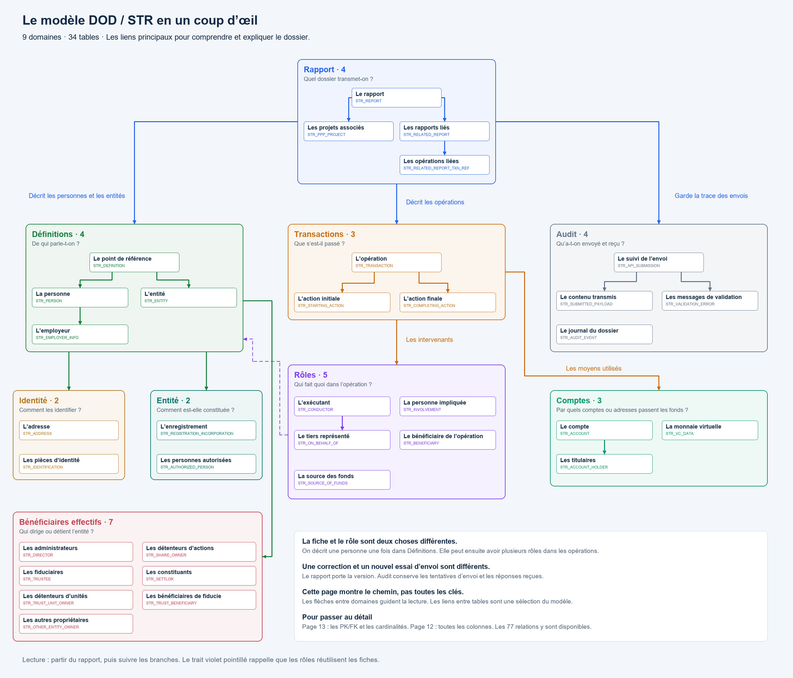
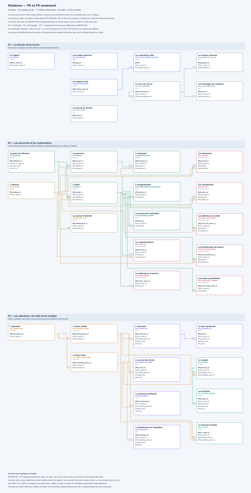

# CANAFE — Modèle de données DOD / STR

Ce projet reprend **les 34 tables et les neuf domaines de projet-io**. Il sert à comprendre le modèle, à le reproduire dans draw.io et à l’expliquer à des collègues. Le périmètre reste celui des déclarations d’opérations douteuses, avec l’historique des versions et le suivi des envois.

Le fil conducteur est simple : **on décrit un rapport, les personnes concernées et les opérations, puis on conserve la trace de ce qui a été transmis.**

## Commencer ici

**[📖 Comprendre le modèle avec des schémas et des exemples](SCHEMAS_EXPLICATIFS.md)**

Ce guide explique les références de fiches, les six types de définition, les rôles, les adresses, les comptes, la propriété, les versions et les envois. Il reprend l’approche pédagogique de l’ancien projet : **tableaux des champs par typeCode, arbres de décision, exemples de lignes et comparaison des choix de clés**. Les propriétés disponibles sont distinguées des propriétés requises, avec des liens vers le Swagger archivé.

**[➡️ Ouvrir la page pédagogique dans draw.io — quatre exemples](https://app.diagrams.net/?splash=0#Uhttps%3A%2F%2Fraw.githubusercontent.com%2Fkhojasahil%2Fprojetdod%2Fmain%2Fdiagrams%2FCANAFE_DOD_EDITION_SIMPLE.drawio#%7B%22pageId%22%3A%22page14%22%7D)**

La **page 15** illustre les fiches et les rôles, une opération, le rattachement d’un compte, puis la différence entre une version et un appel. [Voir l’aperçu](diagrams/images/15-comprendre-les-liens.png).

**[➡️ Commencer par la vue d’ensemble — comprendre le modèle](https://app.diagrams.net/?splash=0#Uhttps%3A%2F%2Fraw.githubusercontent.com%2Fkhojasahil%2Fprojetdod%2Fmain%2Fdiagrams%2FCANAFE_DOD_EDITION_SIMPLE.drawio#%7B%22pageId%22%3A%22page13%22%7D)**

La **page 14** reprend l’esprit de la [carte des domaines de projet-io](https://github.com/khojasahil/projet-io/blob/main/SCHEMAS_EXPLICATIFS.md#1-vue-densemble--carte-des-domaines) : les 34 tables dans neuf groupes colorés, des noms métier et les liens principaux. Partez du rapport, puis suivez les personnes, les opérations et les envois. Cette page de présentation ne montre pas les colonnes; les vues détaillées restent disponibles ci-dessous.



**[➡️ Ouvrir la version simple directement dans draw.io](https://app.diagrams.net/?splash=0#Uhttps%3A%2F%2Fraw.githubusercontent.com%2Fkhojasahil%2Fprojetdod%2Fmain%2Fdiagrams%2FCANAFE_DOD_EDITION_SIMPLE.drawio)**

Cette version permet de modifier chaque table dans un seul bloc de texte, avec un champ par ligne.

**[➡️ Vue conseillée pour expliquer les relations — PK et FK seulement](https://app.diagrams.net/?splash=0#Uhttps%3A%2F%2Fraw.githubusercontent.com%2Fkhojasahil%2Fprojetdod%2Fmain%2Fdiagrams%2FCANAFE_DOD_EDITION_SIMPLE.drawio#%7B%22pageId%22%3A%22page12%22%7D)**

La **page 13** montre les 34 tables avec leurs clés, sans les autres attributs. La **[page 12 — modèle complet aéré](https://app.diagrams.net/?splash=0#Uhttps%3A%2F%2Fraw.githubusercontent.com%2Fkhojasahil%2Fprojetdod%2Fmain%2Fdiagrams%2FCANAFE_DOD_EDITION_SIMPLE.drawio#%7B%22pageId%22%3A%22page11%22%7D)** reprend les 365 colonnes dans la même disposition. Les tables sont réparties en trois parcours : le dossier et les envois, les personnes et les organisations, puis les opérations.

Ces deux vues affichent d’abord les **37 relations métier**. Dans **Vue > Calques**, on peut afficher les **34 liens vers le rapport** et les **6 liens des rôles vers les fiches DEFINITION**. Les 77 relations restent présentes; ce choix évite de superposer tous les traits pendant une présentation. Les onze pages précédentes sont conservées.

[Guide des deux nouvelles vues](docs/EDITION_SIMPLE.md#pages-12-et-13--une-lecture-plus-aérée) · [Aperçu de la vue complète](diagrams/images/12-modele-aere.png)



**[➡️ Ouvrir la page relationnelle complète — toutes les tables, PK/FK et relations](https://app.diagrams.net/?splash=0#Uhttps%3A%2F%2Fraw.githubusercontent.com%2Fkhojasahil%2Fprojetdod%2Fmain%2Fdiagrams%2FCANAFE_DOD_EDITION_SIMPLE.drawio#%7B%22pageId%22%3A%22page10%22%7D)**

La page 11 de la version simple affiche les 34 tables, les 365 colonnes et les 77 connecteurs, y compris entre domaines. [Guide de lecture](docs/EDITION_SIMPLE.md#page-11--les-relations-entre-toutes-les-tables) · [Aperçu](diagrams/images/11-relations-completes.png).

1. Parcourir les images ci-dessous pour retrouver l’architecture déjà présentée.
2. Lire le [guide métier](docs/GUIDE_METIER.md) : une question, une explication et un exemple par domaine.
3. Utiliser les [notes de présentation](docs/PRESENTER_AUX_COLLEGUES.md) pour préparer une réunion d’une dizaine de minutes.
4. Ouvrir le [modèle métier dans draw.io](https://app.diagrams.net/?splash=0#Uhttps%3A%2F%2Fraw.githubusercontent.com%2Fkhojasahil%2Fprojetdod%2Fmain%2Fdiagrams%2FCANAFE_DOD.drawio), puis enregistrer une copie pour le modifier.

## Une architecture qui reste familière


| Domaine | Tables | Question à laquelle il répond |
|---|---:|---|
| 🔵 Rapport | 4 | Quel dossier transmet-on ? |
| 🟢 Définitions | 4 | De qui parle-t-on ? |
| 🟡 Identité | 2 | Comment décrire et identifier ces personnes ou entités ? |
| 🟢 Entité | 2 | Comment l’organisation est-elle constituée ? |
| 🔴 Bénéficiaires effectifs | 7 | Qui dirige ou détient l’entité ? |
| 🟠 Transactions | 3 | Que s’est-il passé ? |
| 🟣 Rôles | 5 | Qui fait quoi dans l’opération ? |
| 💚 Comptes | 3 | Par quels comptes ou adresses les fonds passent-ils ? |
| ⬜ Audit | 4 | Qu’a-t-on envoyé et quelle réponse a-t-on reçue ? |
| **Total** | **34** | |

Tous les noms de tables commencent par `STR_`. Ce préfixe signifie *Suspicious Transaction Report*, l’équivalent anglais de DOD. Les couleurs servent à retrouver les domaines; elles ne portent aucune règle de validation.

## Comprendre une opération

Une opération peut comporter plusieurs actions initiales et plusieurs actions finales. Par exemple, dans une opération de change, on décrit les fonds remis au départ puis la devise remise à l’arrivée.


Les rôles répondent ensuite à une autre question : qui intervient dans ce mouvement ? La fiche d’une personne et son rôle dans une opération sont deux informations distinctes.


## Garder l’historique sans ajouter un domaine

Une ligne de `STR_REPORT` représente **une version du rapport**. Une correction crée une nouvelle ligne, reliée à la précédente. Un nouvel essai d’envoi du même contenu crée seulement une nouvelle ligne de suivi dans `STR_API_SUBMISSION`.


## Les vues à utiliser en réunion

Le fichier principal contient dix pages : neuf vues métier et une grande page du modèle complet. Les domaines Définitions et Identité sont réunis sur une même vue métier pour montrer leurs liens.

| Page | Image à ouvrir ou à insérer dans une présentation |
|---|---|
| 1 | [Vue des neuf domaines](diagrams/images/01-domaines.png) |
| 2 | [Rapport et références liées](diagrams/images/02-rapport.png) |
| 3 | [Définitions et identité](diagrams/images/03-personnes-identite.png) |
| 4 | [Entité : enregistrement et personnes autorisées](diagrams/images/04-entite.png) |
| 5 | [Direction et propriété de l’entité](diagrams/images/05-propriete.png) |
| 6 | [Transactions](diagrams/images/06-transactions.png) |
| 7 | [Rôles](diagrams/images/07-roles.png) |
| 8 | [Comptes et monnaie virtuelle](diagrams/images/08-comptes.png) |
| 9 | [Audit et suivi des envois](diagrams/images/09-audit.png) |
| 10 | [Modèle complet : les neuf domaines, les 34 tables et leurs 365 colonnes](diagrams/images/10-modele-complet.png) |

Les images et les pages draw.io partagent la même composition. Les cartes montrent une sélection de colonnes pour faciliter la lecture. `0..N` signifie « aucun, un ou plusieurs ». Les clés, les obligations et les liens non affichés sont détaillés dans la documentation de construction.

### Voir tout le modèle sur une seule page

L’onglet **« Le modèle complet — domaines, tables et colonnes »** réunit les 34 tables, leurs 365 colonnes, les types logiques et les repères PK/FK. Les 77 références sont indiquées au bas des cartes, y compris les liens entre domaines. Des notes expliquent les points à retenir : la personne et son rôle, les versions et les tentatives d’envoi, ou encore le rattachement d’un compte à une action.

[Ouvrir directement la page complète dans draw.io](https://app.diagrams.net/?splash=0#Uhttps%3A%2F%2Fraw.githubusercontent.com%2Fkhojasahil%2Fprojetdod%2Fmain%2Fdiagrams%2FCANAFE_DOD.drawio#%7B%22pageId%22%3A%22page9%22%7D) · [Image PNG](diagrams/images/10-modele-complet.png) · [Image vectorielle SVG](diagrams/images/10-modele-complet.svg)

Cette planche est faite pour être parcourue en zoomant. Les vues métier précédentes restent les plus adaptées à une présentation projetée.

## Reproduire le modèle

- **[Version facile à modifier — CANAFE_DOD_EDITION_SIMPLE.drawio](diagrams/CANAFE_DOD_EDITION_SIMPLE.drawio)** : quinze pages, dont une page pédagogique, une vue d’ensemble par domaine, une vue complète aérée et une vue limitée aux clés. Une seule forme et un texte multiligne par table. Un champ par ligne; les notes sont aussi des blocs uniques. [Mode d’emploi](docs/EDITION_SIMPLE.md).
- [Guide draw.io](docs/GUIDE_DRAWIO.md) : ouvrir, modifier ou redessiner les vues.
- [Fichier principal — neuf vues métier et une vue complète](diagrams/CANAFE_DOD.drawio).
- [Annexe draw.io — les 34 tables avec toutes leurs colonnes](diagrams/CANAFE_DOD_DETAIL.drawio).
- [Dictionnaire](docs/DICTIONNAIRE.md) : les 365 colonnes, leur utilité, leurs règles et leurs références Swagger.
- [Registre des relations](docs/RELATIONS.md) : les liens et leurs cardinalités, pour tracer les connecteurs.
- [Continuité avec projet-io](docs/COMPARAISON_PROJET_IO.md) : ce qui est conservé et ce qui est précisé.

## Pour l’équipe qui alimentera les données

[Choix de conception](docs/ANALYSE.md) · [Alimentation et versions](docs/ALIMENTATION.md) · [Règles et points à confirmer](docs/REGLES.md) · [Domaines de codes](docs/DOMAINES_CODES.md)

La traçabilité couvre **486 occurrences de champs nommés**, dont **437 dans le rapport STR**, variantes comprises. Ce nombre décrit les chemins du Swagger, pas le nombre de colonnes. Les champs communs à plusieurs variantes partagent une colonne; les réponses API sont aussi conservées intégralement.

- [Correspondance champ → colonne → Swagger](traceability/fields.csv)
- [Objets, listes et obligations de présence](traceability/structures.csv)
- [Résultats et limites des contrôles](quality/CONTROLES.md)

Source : [Swagger CANAFE](https://www148.fintrac-canafe.canada.ca/swagger), copie du **22 septembre 2026**, version déclarée `1.0.0`. Le [YAML original](source/swaggerExternal.yaml) et sa [provenance](source/provenance.json) sont conservés. Quelques ambiguïtés du contrat sont documentées; les contrôles locaux ne constituent pas une homologation CANAFE. Aucun rapport réel n’a été transmis.

Ce dépôt contient un modèle logique et sa documentation, **sans script de création de tables**.

## Étude d’évolution vers les DTV

L’[analyse de faisabilité d’un modèle commun DOD + DTV](docs/ANALYSE_DOD_DTV.md) compare les contrats, les variantes de fiches, les rôles et les comptes. Elle propose un socle partagé avec des extensions par déclaration. **Il s’agit d’une proposition d’évolution; les diagrammes et le dictionnaire livrés restent ceux de la DOD.**

<details>
<summary>Regénérer les livrables et vérifier leur cohérence</summary>

Python 3.10 ou plus récent et Pillow sont nécessaires. Depuis la racine du dépôt :

```text
python tools/generate.py
python tools/verify.py
python tools/simple_editing.py
```

Les fichiers de référence sont le Swagger archivé, le catalogue `tools/build_model.py` et les compositions `tools/render_models.py`. La régénération ne modifie pas les guides rédigés ni le YAML officiel. Les polices Arial sont utilisées sous Windows; DejaVu Sans sert de repli sous Linux.

</details>
