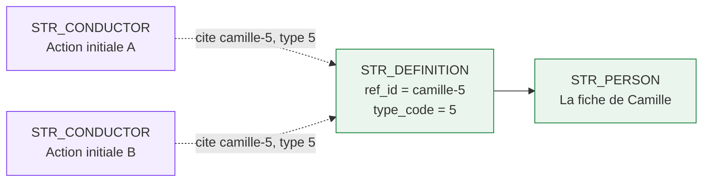
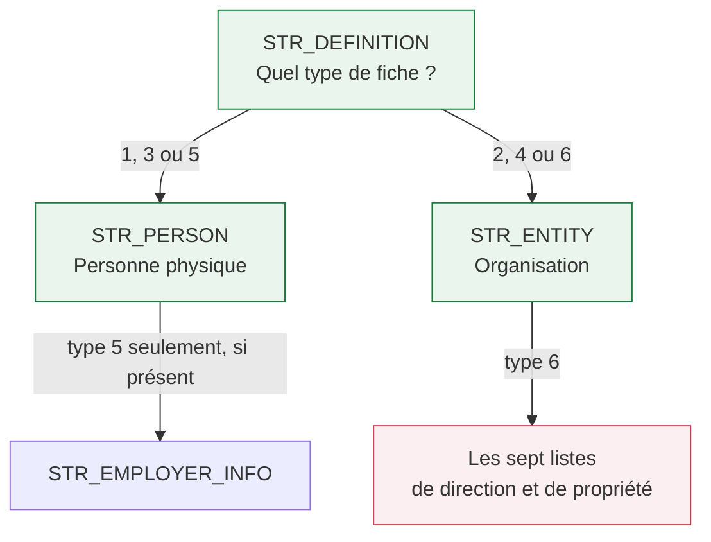
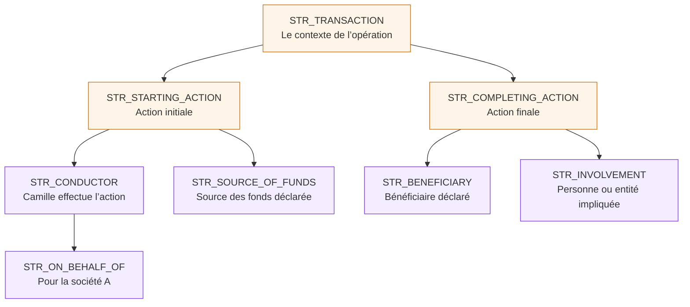
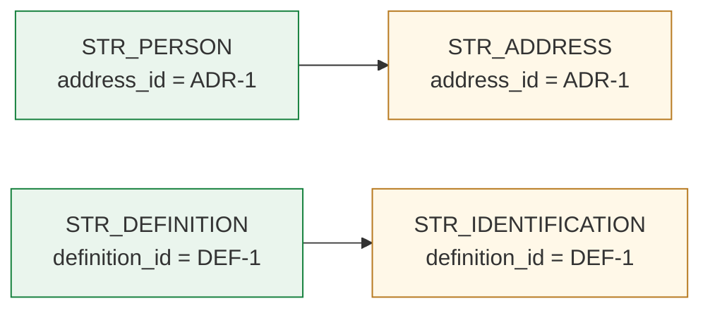
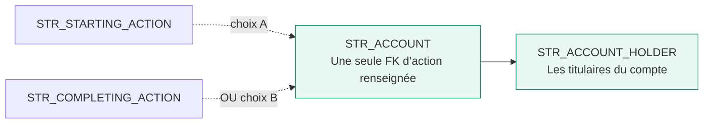
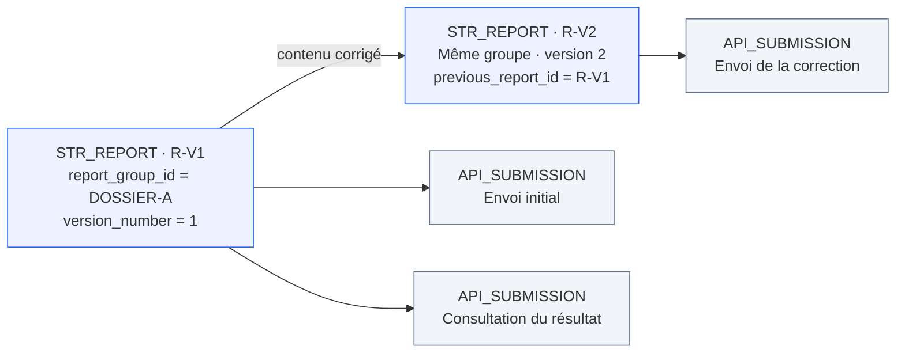
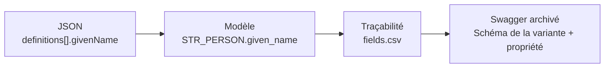

# Comprendre le modèle DOD / STR avec des exemples

Ce guide accompagne les **34 tables et les neuf domaines de projetdod**. Il reprend l’approche visuelle de [l’ancien document](https://github.com/khojasahil/projet-io/blob/main/SCHEMAS_EXPLICATIFS.md), avec les clés et les choix du modèle actuel.

L’exemple est fictif : **Camille effectue deux opérations pour la société A**. Il sert à expliquer où ranger les renseignements. Il ne constitue ni une déclaration complète ni une conclusion sur le caractère suspect des opérations.

[Ouvrir la page pédagogique dans draw.io — page 15](https://app.diagrams.net/?splash=0#Uhttps%3A%2F%2Fraw.githubusercontent.com%2Fkhojasahil%2Fprojetdod%2Fmain%2Fdiagrams%2FCANAFE_DOD_EDITION_SIMPLE.drawio#%7B%22pageId%22%3A%22page14%22%7D) · [Voir les PK/FK — page 13](https://app.diagrams.net/?splash=0#Uhttps%3A%2F%2Fraw.githubusercontent.com%2Fkhojasahil%2Fprojetdod%2Fmain%2Fdiagrams%2FCANAFE_DOD_EDITION_SIMPLE.drawio#%7B%22pageId%22%3A%22page12%22%7D)

## Le parcours de lecture

1. [Retrouver les domaines](#1-retrouver-les-domaines)
2. [Distinguer la fiche et le rôle](#2-distinguer-la-fiche-et-le-rôle)
3. [Comprendre les six types de définition](#3-comprendre-les-six-types-de-définition)
4. [Suivre une opération](#4-suivre-une-opération)
5. [Rattacher les adresses et les comptes](#5-rattacher-les-adresses-et-les-comptes)
6. [Comprendre la direction et la propriété](#6-comprendre-la-direction-et-la-propriété)
7. [Séparer les versions et les envois](#7-séparer-les-versions-et-les-envois)
8. [Retrouver le Swagger derrière une colonne](#8-retrouver-le-swagger-derrière-une-colonne)

## 1. Retrouver les domaines

Le **rapport** donne le contexte. Les **définitions** décrivent les personnes et les organisations. Les **transactions** racontent les opérations et leurs actions. Les **rôles** précisent qui intervient, les **comptes** les moyens utilisés, et l’**audit** ce qui a été envoyé et reçu.

Les domaines **Identité**, **Entité** et **Bénéficiaires effectifs** complètent la description des personnes ou organisations. Ils ne constituent pas des opérations supplémentaires.

Les flèches de cette carte montrent un parcours de lecture et une sélection des liens. Pour les clés et les cardinalités complètes, utiliser les pages 11 à 13 du fichier simple.

## 2. Distinguer la fiche et le rôle

**La fiche répond à « qui est Camille ? ». Le rôle répond à « que fait Camille dans cette action ? ».**

Dans une même version de rapport, deux lignes d’exécutant peuvent citer la même définition de Camille. Son nom et ses autres renseignements ne sont pas recopiés dans chaque ligne d’exécutant.

Ces flèches pointillées se lisent « cite la fiche »; elles ne représentent pas le sens normalisé d’un diagramme de clés étrangères.

| Repère | À quoi sert-il ? | Exemple |
|---|---|---|
| PK, comme `definition_id` | Identifier une ligne dans notre stockage | La ligne de définition de Camille |
| FK, comme `PERSON.definition_id` | Relier une ligne à son parent | La personne appartient à cette définition |
| `ref_id` | Porter la référence déclarative `refId` utilisée dans le JSON | `camille-5` |
| `str_report_id` | Fixer la version du rapport dans laquelle on travaille | `R-V1` |

Dans le modèle actuel, `ref_id` est unique dans une version. Une référence de rôle se vérifie avec **`(str_report_id, type_code, ref_id)`** : on contrôle la fiche, son type et sa version ensemble. `definition_id` reste une clé interne; elle n’est pas envoyée à la place de `refId`.

**À ne pas confondre :** une fiche déclarative n’est pas une identité client universelle. Si Camille apparaît comme exécutante de type 5 et comme titulaire de compte de type 1, il faut des définitions distinctes avec des `ref_id` distincts dans cette version. On ne réutilise pas sa référence de type 5 pour un rôle qui exige le type 1.

Sources : [choix de conception](docs/ANALYSE.md#une-person-et-une-entity-selon-le-type-de-définition), [règles d’intégrité](docs/REGLES.md#intégrité-à-implanter).

## 3. Comprendre les six types de définition

Le `type_code` indique **la forme de fiche attendue**. Il ne mesure ni le risque de la personne ni le niveau de soupçon. Nous conservons une seule table PERSON et une seule table ENTITY; le type détermine les colonnes et les sous-objets applicables.

| Codes | Forme de fiche | Rôles qui la citent |
|---|---|---|
| 1 personne / 2 entité | Nom | SOURCE_OF_FUNDS, INVOLVEMENT, ACCOUNT_HOLDER |
| 3 personne / 4 entité | Renseignements détaillés | BENEFICIARY |
| 5 personne / 6 entité | Variante avec employeur possible, ou direction et propriété | CONDUCTOR, ON_BEHALF_OF |

Une définition donne **une PERSON ou une ENTITY**, selon son code. Elle ne crée pas les deux. « Applicable » ne veut pas dire que chaque colonne de cette variante doit être remplie : les obligations exactes restent celles du contrat et des règles documentées.

Voir le [guide métier](docs/GUIDE_METIER.md#2-définitions--de-qui-parle-t-on-) et le [dictionnaire des colonnes](docs/DICTIONNAIRE.md).

## 4. Suivre une opération

Camille agit pour la société A. On décrit l’opération, puis ses actions initiales et finales. Le rôle d’exécutant cite Camille; le tiers représenté cite la société A.

Ce dessin montre les rattachements possibles. Il ne demande pas de créer tous les rôles pour chaque opération. La société représentée n’est pas automatiquement la source des fonds; l’exécutante n’est pas automatiquement titulaire du compte.

Il peut y avoir plusieurs actions initiales et plusieurs actions finales. Il n’y a pas nécessairement une paire « une initiale = une finale ». Une action initiale n’est pas non plus automatiquement une entrée de fonds : son champ `direction` participe à la description du mouvement.

## 5. Rattacher les adresses et les comptes

### Une adresse : la fiche porte le lien

La personne, l’entité ou un autre propriétaire prévu possède un `address_id` facultatif. Une adresse appartient à un seul propriétaire dans la version. Les pièces d’identification sont rattachées à la définition.

**Différence avec l’ancien document :** projetdod n’utilise pas le couple générique `owner_type / owner_id` pour ces liens. Il utilise les clés explicites du [modèle actuel](docs/ANALYSE.md#adresses-comptes-et-listes). Le contrôle d’un seul propriétaire d’adresse, y compris entre tables différentes, reste à implanter.

### Un compte : choisir l’action à laquelle il appartient

| Rattachement du compte | `starting_action_id` | `completing_action_id` |
|---|---|---|
| Action initiale A | Identifiant de A | Vide |
| Action finale B | Vide | Identifiant de B |

Remplir les deux clés, ou les laisser toutes les deux vides, ne respecte pas le modèle. Cette alternative s’applique aussi à `STR_VC_DATA`. Chaque action peut avoir au plus un compte, mais plusieurs données de monnaie virtuelle.

Dans VC_DATA, `data_type` distingue les identifiants de transactions, les adresses émettrices et les adresses réceptrices. `ordinal` garde la position dans la liste. Dans le modèle actuel, on n’utilise pas `action_type / action_id` pour choisir le parent.

## 6. Comprendre la direction et la propriété

Les sept tables du domaine « Bénéficiaires effectifs » correspondent aux listes de la définition d’entité de type 6. Elles se rattachent à **STR_ENTITY**.

| Pour décrire… | Tables concernées, préfixe STR_ omis |
|---|---|
| Les administrateurs et détenteurs d’actions | DIRECTOR, SHARE_OWNER |
| Les intervenants d’une fiducie | TRUSTEE, SETTLOR, TRUST_UNIT_OWNER, TRUST_BENEFICIARY |
| Les propriétaires d’une autre forme d’entité | OTHER_ENTITY_OWNER |

Les renseignements à alimenter dépendent de l’entité et des règles applicables. Le schéma exige les sept listes pour le type 6, tout en autorisant des listes vides. Ce tableau explique leur contenu; il ne remplace pas une règle de conformité.

Ces listes portent directement des noms et, selon la liste, des coordonnées. Elles ne citent pas les fiches DEFINITION par `refId`. **Le bénéficiaire d’une fiducie et le bénéficiaire d’une opération sont deux notions différentes.**

## 7. Séparer les versions et les envois

**Une correction change le contenu. Une nouvelle tentative ou une consultation ajoute une trace d’appel.**

Chaque version a son propre `str_report_id`. Les deux versions partagent `report_group_id`. Une correction recrée aussi ses lignes enfants et leurs clés; elle ne reprend pas les liens internes vers les enfants de l’ancienne version.

| Information à retrouver | Où la chercher ? |
|---|---|
| Contenu exact envoyé | STR_SUBMITTED_PAYLOAD |
| Appel, réponse complète et résultat suivi | STR_API_SUBMISSION |
| Erreurs ou avertissements consultables | STR_VALIDATION_ERROR |
| Décisions et actions internes | STR_AUDIT_EVENT |

Un statut HTTP positif ne prouve pas à lui seul l’acceptation du rapport. Après une interruption réseau, il faut rechercher le résultat avant de retransmettre. Les anciennes réponses et les anciens contenus restent conservés.

Ce schéma illustre les choix d’historisation du modèle; ce n’est pas un calendrier réglementaire. [Extrait de lignes fictives](examples/parcours-metier.json) · [Alimentation et versions](docs/ALIMENTATION.md).

## 8. Retrouver le Swagger derrière une colonne

Prenons le prénom de Camille. Dans le document JSON, il se trouve dans une définition, sous `givenName`. Dans le modèle, il est rangé dans `STR_PERSON.given_name`.

Une même colonne peut correspondre à plusieurs lignes de traçabilité, car le prénom existe dans plusieurs variantes de personne. À l’inverse, une clé de stockage comme `person_id` est un choix interne et n’est pas une propriété à envoyer à CANAFE.

Pour justifier une colonne, ouvrir le [dictionnaire](docs/DICTIONNAIRE.md), puis retrouver son chemin dans [fields.csv](traceability/fields.csv). Les contraintes viennent du [Swagger archivé](source/swaggerExternal.yaml); les règles ajoutées pour les versions, les clés et l’audit sont distinguées dans [REGLES.md](docs/REGLES.md).

## Une façon simple de le présenter aux collègues

« Nous préparons une version du rapport. Nous décrivons les personnes et les organisations, puis les opérations. Chaque rôle cite la fiche appropriée dans cette version. Les comptes et les adresses ont des rattachements explicites. Enfin, nous gardons le contenu envoyé et les réponses, afin de distinguer une correction d’un nouvel appel. »

Pour approfondir : [guide métier](docs/GUIDE_METIER.md), [comparaison avec projet-io](docs/COMPARAISON_PROJET_IO.md), [registre des relations](docs/RELATIONS.md).
