# Comprendre le modèle DOD / STR avec des exemples

Ce guide accompagne les **34 tables et les neuf domaines de projetdod**. Il reprend l’approche visuelle de [l’ancien document](https://github.com/khojasahil/projet-io/blob/main/SCHEMAS_EXPLICATIFS.md), avec les clés et les choix du modèle actuel.

L’exemple est fictif : **Camille effectue deux opérations pour la société A**. Il sert à expliquer où ranger les renseignements. Il ne constitue ni une déclaration complète ni une conclusion sur le caractère suspect des opérations.

[Ouvrir la page pédagogique dans draw.io — page 15](https://app.diagrams.net/?splash=0#Uhttps%3A%2F%2Fraw.githubusercontent.com%2Fkhojasahil%2Fprojetdod%2Fmain%2Fdiagrams%2FCANAFE_DOD_EDITION_SIMPLE.drawio#%7B%22pageId%22%3A%22page14%22%7D) · [Voir les PK/FK — page 13](https://app.diagrams.net/?splash=0#Uhttps%3A%2F%2Fraw.githubusercontent.com%2Fkhojasahil%2Fprojetdod%2Fmain%2Fdiagrams%2FCANAFE_DOD_EDITION_SIMPLE.drawio#%7B%22pageId%22%3A%22page12%22%7D)

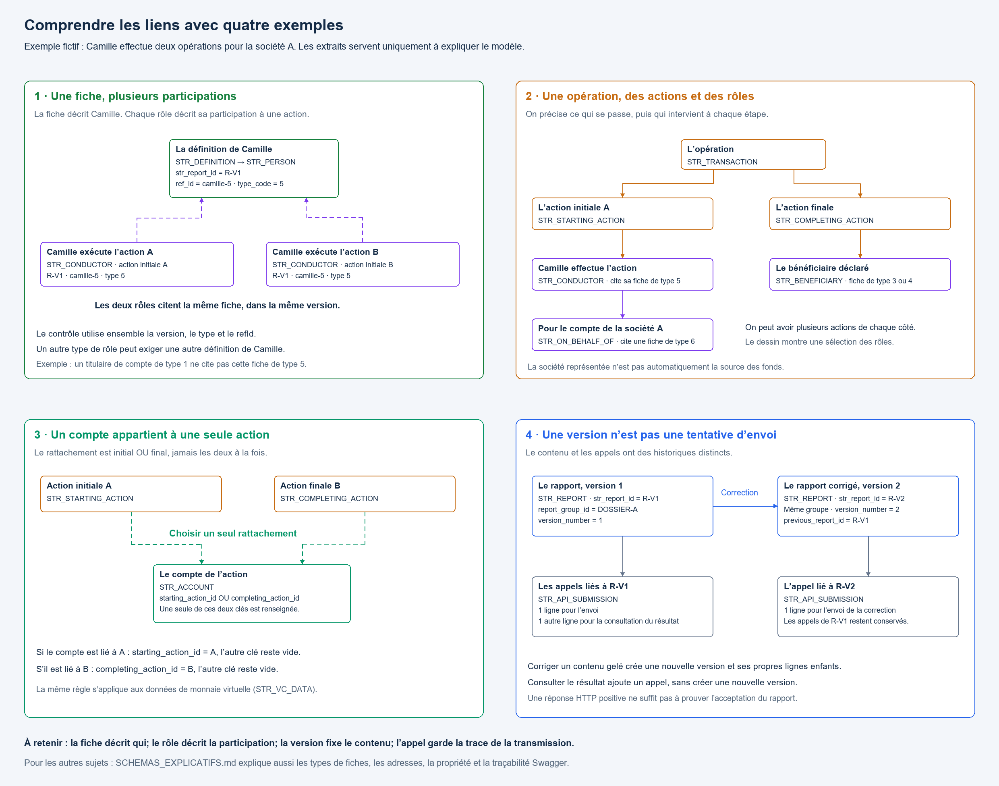

## Le parcours de lecture

1. [Retrouver les domaines](#1-retrouver-les-domaines)
2. [Distinguer la fiche et le rôle](#2-distinguer-la-fiche-et-le-rôle)
3. [Comprendre les six types de définition](#3-comprendre-les-six-types-de-définition)
4. [Suivre une opération](#4-suivre-une-opération)
5. [Rattacher les adresses et les comptes](#5-rattacher-les-adresses-et-les-comptes)
6. [Comprendre la direction et la propriété](#6-comprendre-la-direction-et-la-propriété)
7. [Séparer les versions et les envois](#7-séparer-les-versions-et-les-envois)
8. [Retrouver le Swagger derrière une colonne](#8-retrouver-le-swagger-derrière-une-colonne)

## 1. Retrouver les domaines

Le **rapport** donne le contexte. Les **définitions** décrivent les personnes et les organisations. Les **transactions** racontent les opérations et leurs actions. Les **rôles** précisent qui intervient, les **comptes** les moyens utilisés, et l’**audit** ce qui a été envoyé et reçu.

Les domaines **Identité**, **Entité** et **Bénéficiaires effectifs** complètent la description des personnes ou organisations. Ils ne constituent pas des opérations supplémentaires.

Les flèches de cette carte montrent un parcours de lecture et une sélection des liens. Pour les clés et les cardinalités complètes, utiliser les pages 11 à 13 du fichier simple.

## 2. Distinguer la fiche et le rôle

**La fiche répond à « qui est Camille ? ». Le rôle répond à « que fait Camille dans cette action ? ».**

Dans une même version de rapport, deux lignes d’exécutant peuvent citer la même définition de Camille. Son nom et ses autres renseignements ne sont pas recopiés dans chaque ligne d’exécutant.

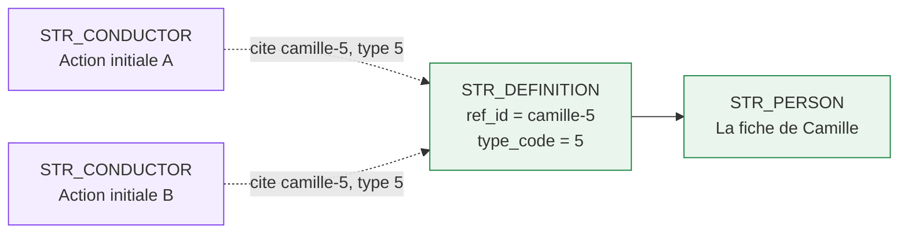

Ces flèches pointillées se lisent « cite la fiche »; elles ne représentent pas le sens normalisé d’un diagramme de clés étrangères.

| Repère | À quoi sert-il ? | Exemple |
|---|---|---|
| PK, comme `definition_id` | Identifier une ligne dans notre stockage | La ligne de définition de Camille |
| FK, comme `PERSON.definition_id` | Relier une ligne à son parent | La personne appartient à cette définition |
| `ref_id` | Porter la référence déclarative `refId` utilisée dans le JSON | `camille-5` |
| `str_report_id` | Fixer la version du rapport dans laquelle on travaille | `R-V1` |

Dans le modèle actuel, `ref_id` est unique dans une version. Une référence de rôle se vérifie avec **`(str_report_id, type_code, ref_id)`** : on contrôle la fiche, son type et sa version ensemble. `definition_id` reste une clé interne; elle n’est pas envoyée à la place de `refId`.

**À ne pas confondre :** une fiche déclarative n’est pas une identité client universelle. Si Camille apparaît comme exécutante de type 5 et comme titulaire de compte de type 1, il faut des définitions distinctes avec des `ref_id` distincts dans cette version. On ne réutilise pas sa référence de type 5 pour un rôle qui exige le type 1.

Sources : [choix de conception](docs/ANALYSE.md#une-person-et-une-entity-selon-le-type-de-définition), [règles d’intégrité](docs/REGLES.md#intégrité-à-implanter).

## 3. Comprendre les six types de définition

### Le polymorphisme typeCode, en mots simples

Le mot *polymorphisme* signifie ici qu’une définition peut prendre plusieurs formes. `STR_DEFINITION.type_code` indique laquelle : **une personne ou une entité, avec le contenu prévu pour le rôle qui la cite**. Dans le Swagger DOD, `definitions[].items.oneOf` propose six schémas possibles.

Imaginez un formulaire qui adapte ses rubriques à la situation. Pour citer un nom, quelques rubriques suffisent. Pour décrire un exécutant, le formulaire propose aussi des renseignements personnels ou ceux de l’organisation représentée. On ne crée pas six tables : on garde **une table PERSON et une table ENTITY**, et le code détermine les champs applicables.

Le code ne mesure ni le risque de la personne ni le niveau de soupçon. La règle fiable est celle du **rôle et des codes qu’il accepte**, pas une notion de « proximité avec la transaction ».

### Arbre de décision — quelle fiche crée-t-on ?

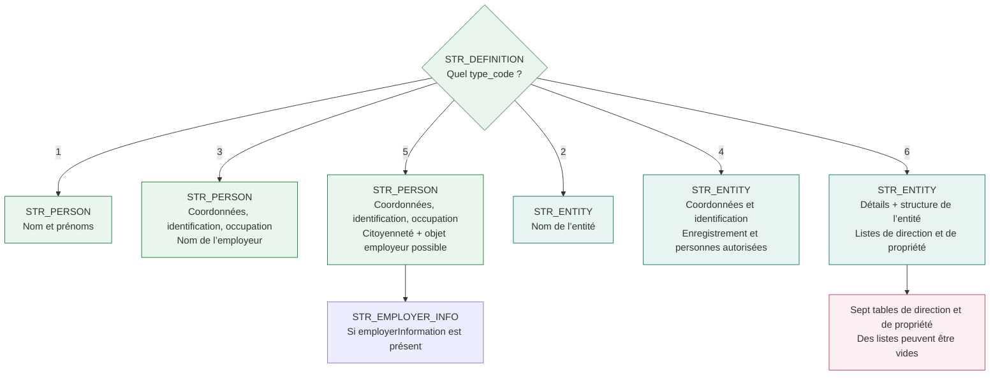

Pour une définition, on crée **une PERSON ou une ENTITY**, jamais les deux. Dans les tableaux suivants, les noms de champs sont ceux du JSON Swagger; les tables de stockage utilisent les noms du dictionnaire.

### Tableau comparatif — personnes

**Légende :** ✅ = propriété déclarée dans cette variante; — = propriété non déclarée dans cette variante. Une coche ne signifie pas « valeur obligatoire ». `[]` désigne une liste et `{}` un objet.

| Champ JSON | Type 1 | Type 3 | Type 5 | Où le ranger ? |
|---|:---:|:---:|:---:|---|
| `surname` | ✅ | ✅ | ✅ | PERSON.surname |
| `givenName` | ✅ | ✅ | ✅ | PERSON.given_name |
| `otherNameInitial` | ✅ | ✅ | ✅ | PERSON.other_name_initial |
| `alias` | — | ✅ | ✅ | PERSON.alias |
| `telephoneNumber` | — | ✅ | ✅ | PERSON.telephone_number |
| `extensionNumber` | — | ✅ | ✅ | PERSON.extension_number |
| `dateOfBirth` | — | ✅ | ✅ | PERSON.date_of_birth |
| `countryOfResidenceCode` | — | ✅ | ✅ | PERSON.country_of_residence_code |
| `occupation` | — | ✅ | ✅ | PERSON.occupation |
| `nameOfEmployer` | — | ✅ | — | PERSON.name_of_employer |
| `addressTypeCode` | — | ✅ | ✅ | PERSON.address_type_code |
| `address {}` | — | ✅ | ✅ | ADDRESS, reliée par PERSON.address_id |
| `identifications []` | — | ✅ | ✅ | IDENTIFICATION, reliée à DEFINITION |
| `countryOfCitizenshipCode` | — | — | ✅ | PERSON.country_of_citizenship_code |
| `employerInformation {}` | — | — | ✅ | EMPLOYER_INFO, reliée à PERSON |

Le type 3 possède un **nom d’employeur simple** (`nameOfEmployer`). Le type 5 possède plutôt un **objet employeur** pouvant contenir son nom, son adresse, son téléphone et son poste téléphonique. Le type 5 n’est donc pas une copie du type 3 à laquelle on ajoute seulement deux colonnes.

| Dans `employerInformation` du type 5 | Stockage |
|---|---|
| `name` | EMPLOYER_INFO.name |
| `addressTypeCode` | EMPLOYER_INFO.address_type_code |
| `address {}` | ADDRESS, reliée par EMPLOYER_INFO.address_id |
| `telephoneNumber` | EMPLOYER_INFO.telephone_number |
| `extensionNumber` | EMPLOYER_INFO.extension_number |

**Comptage précis :** hors `typeCode` et `refId`, le type 1 déclare **3 propriétés**, le type 3 **13**, et le type 5 **14**. Une liste ou un objet compte ici pour une propriété : les champs internes de l’employeur ne sont pas additionnés. Ce n’est ni un nombre de colonnes à remplir ni un nombre de valeurs obligatoires.

Sources : [PersonName](source/swaggerExternal.yaml#L5273), [PersonDetails](source/swaggerExternal.yaml#L5305), [personAndEmployerDetails](source/swaggerExternal.yaml#L5771).

### Tableau comparatif — entités

| Champ JSON | Type 2 | Type 4 | Type 6 | Où le ranger ? |
|---|:---:|:---:|:---:|---|
| `nameOfEntity` | ✅ | ✅ | ✅ | ENTITY.name_of_entity |
| `telephoneNumber` | — | ✅ | ✅ | ENTITY.telephone_number |
| `extensionNumber` | — | ✅ | ✅ | ENTITY.extension_number |
| `natureOfPrincipalBusiness` | — | ✅ | ✅ | ENTITY.nature_of_principal_business |
| `addressTypeCode` | — | ✅ | ✅ | ENTITY.address_type_code |
| `address {}` | — | ✅ | ✅ | ADDRESS, reliée par ENTITY.address_id |
| `identifications []` | — | ✅ | ✅ | IDENTIFICATION, reliée à DEFINITION |
| `authorizedPersons []` | — | ✅ | ✅ | AUTHORIZED_PERSON |
| `registrationIncorporationIndicator` | — | ✅ | ✅ | ENTITY.registration_incorporation_indicator |
| `registrationsIncorporations []` | — | ✅ | ✅ | REGISTRATION_INCORPORATION |
| `structureTypeCode` | — | — | ✅ | ENTITY.structure_type_code |
| `structureTypeOther` | — | — | ✅ | ENTITY.structure_type_other |
| `directorsOfCorporation []` | — | — | ✅ | DIRECTOR |
| `personsOwningSharesOfCorporation []` | — | — | ✅ | SHARE_OWNER |
| `trusteesOfTrust []` | — | — | ✅ | TRUSTEE |
| `settlorsOfTrust []` | — | — | ✅ | SETTLOR |
| `personsOwningUnitsOfTrust []` | — | — | ✅ | TRUST_UNIT_OWNER |
| `beneficiariesOfTrust []` | — | — | ✅ | TRUST_BENEFICIARY |
| `personsOwningEntityNotCorporationOrTrust []` | — | — | ✅ | OTHER_ENTITY_OWNER |

Hors `typeCode` et `refId`, cela donne **1 propriété pour le type 2**, **10 pour le type 4** et **19 pour le type 6**, selon le même mode de comptage.

Le Swagger archivé ne fixe pas de `maxItems: 3` sur les listes `authorizedPersons` de ces deux variantes. La mention « maximum 3 » de l’ancien support n’est donc pas reprise comme contrainte vérifiée de ce contrat.

Sources : [EntityName](source/swaggerExternal.yaml#L5291), [EntityDetails](source/swaggerExternal.yaml#L5348), [entityAndBeneficialOwnershipDetails](source/swaggerExternal.yaml#L5831).

### Disponible et requis : deux questions différentes

Le tableau précédent répond à « cette rubrique existe-t-elle dans ce type de fiche ? ». Le mot `required` du Swagger répond à « cette propriété doit-elle être présente dans le JSON ? ».

| Types | Propriétés requises directement sur la définition |
|---|---|
| 1 et 2 | `typeCode`, `refId` |
| 3 et 5 | `typeCode`, `refId`, `identifications` |
| 4 | `typeCode`, `refId`, `identifications`, `authorizedPersons`, `registrationsIncorporations` |
| 6 | Les mêmes que le type 4, plus les sept listes de direction et de propriété |

Ces listes n’ont pas de minimum d’éléments dans ces schémas : une liste requise peut donc être `[]`. Un objet facultatif peut avoir ses propres propriétés requises lorsqu’il est présent. Les règles métier conditionnelles et les obligations applicables restent distinctes de ce tableau technique.

### Qui utilise quel typeCode ?

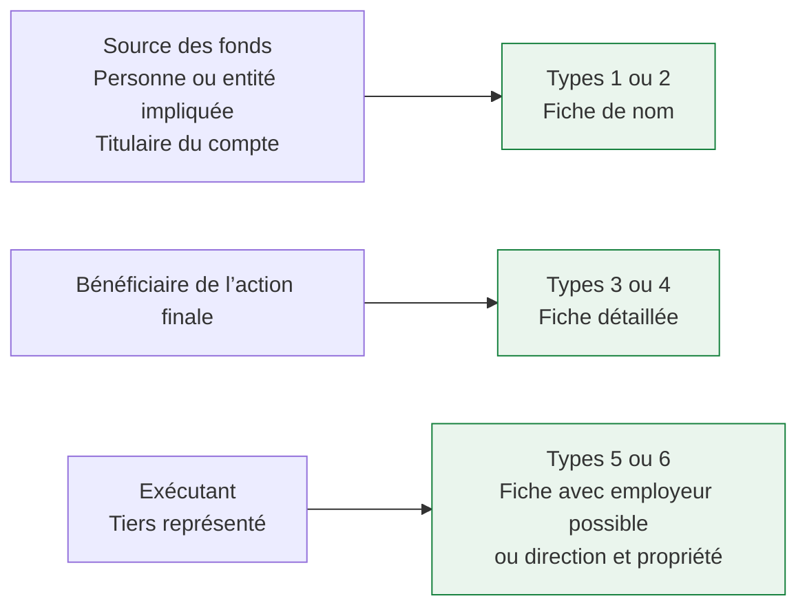

| Table du rôle | Codes acceptés | Exemple de lecture |
|---|---|---|
| STR_SOURCE_OF_FUNDS | 1 personne / 2 entité | Qui est déclaré comme source des fonds ? |
| STR_INVOLVEMENT | 1 / 2 | Qui est impliqué dans l’action finale ? |
| STR_ACCOUNT_HOLDER | 1 / 2 | Qui est titulaire du compte ? |
| STR_BENEFICIARY | 3 personne / 4 entité | Qui bénéficie de l’action finale ? |
| STR_CONDUCTOR | 5 personne / 6 entité | Qui effectue l’action ? |
| STR_ON_BEHALF_OF | 5 / 6 | Pour le compte de qui agit-on ? |

**Exemple à expliquer :** Camille peut être exécutante et titulaire. Sa ligne CONDUCTOR cite `camille-5`, de type 5. Sa ligne ACCOUNT_HOLDER cite une autre définition, `camille-1`, de type 1. Même personne réelle, deux formes déclaratives adaptées à deux rôles.

Pour reconstruire le JSON, on sélectionne les champs de la variante active. Le fait que la table PERSON possède une colonne `country_of_citizenship_code` ne permet pas de l’émettre dans une définition de type 1.

Références : [les six branches DOD du oneOf](source/swaggerExternal.yaml#L1412), [règles de référence des rôles](docs/REGLES.md#intégrité-à-implanter), [dictionnaire des colonnes](docs/DICTIONNAIRE.md).

## 4. Suivre une opération

Camille agit pour la société A. On décrit l’opération, puis ses actions initiales et finales. Le rôle d’exécutant cite Camille; le tiers représenté cite la société A.

### Vue simplifiée — le contexte et le mouvement

Prenons une opération de change fictive : des fonds en dollars canadiens sont remis, puis une devise est obtenue. Les montants ci-dessous ne constituent pas un exemple de déclaration complète.

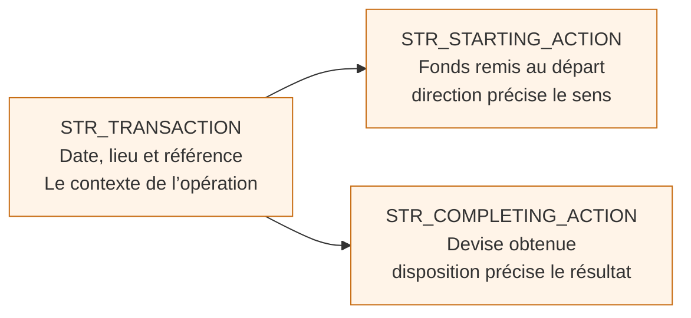

| Table | Question | Exemples de renseignements |
|---|---|---|
| TRANSACTION | Quel événement décrit-on ? | Date, lieu, référence, opération tentée ou réalisée |
| STARTING_ACTION | Quelle action initiale est décrite ? | Sens, nature des fonds, montant, devise |
| COMPLETING_ACTION | Quelle action finale est décrite ? | Disposition, montant, devise, valeur en dollars canadiens |

Il faut éviter de traduire systématiquement STARTING par « l’argent entre » et COMPLETING par « l’argent sort ». Pour une action initiale, le Swagger prévoit `direction=1` pour une entrée et `direction=2` pour une sortie. La disposition de l’action finale décrit ce qui a été fait des fonds. [Source du champ direction](source/swaggerExternal.yaml#L1493).

### Vue détaillée — les cinq rôles et les moyens utilisés

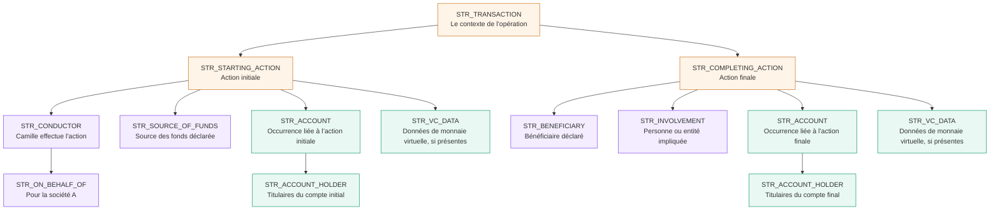

Ce dessin montre les rattachements possibles. Il ne demande pas de créer tous les rôles pour chaque opération. La société représentée n’est pas automatiquement la source des fonds; l’exécutante n’est pas automatiquement titulaire du compte.

ACCOUNT, ACCOUNT_HOLDER et VC_DATA apparaissent deux fois dans le dessin pour montrer les deux branches. Ce sont **des occurrences des mêmes tables**, pas six tables nouvelles. Chaque compte ou donnée de monnaie virtuelle se rattache à une seule action.

### Exemple de lignes — qui fait quoi ?

Les identifiants et noms sont fictifs. Les colonnes sans lien avec l’explication sont omises. Toutes ces lignes appartiennent à `R-V1`.

| Table | Ligne | Parent | Fiche citée | Lecture métier |
|---|---|---|---|---|
| TRANSACTION | `T-1` | Rapport `R-V1` | — | L’opération de change |
| STARTING_ACTION | `A-1` | Opération `T-1` | — | L’action initiale |
| COMPLETING_ACTION | `B-1` | Opération `T-1` | — | L’action finale |
| CONDUCTOR | `C-1` | Action `A-1` | `camille-5`, type 5 | Camille effectue l’action |
| ON_BEHALF_OF | `O-1` | Exécutant `C-1` | `societe-a-6`, type 6 | Camille agit pour la société A |

On ajoutera les autres rôles si les faits à déclarer les justifient. Aucun rôle n’est déduit automatiquement de la présence d’un autre.

Il peut y avoir plusieurs actions initiales et plusieurs actions finales. Il n’y a pas nécessairement une paire « une initiale = une finale ». Une action initiale n’est pas non plus automatiquement une entrée de fonds : son champ `direction` participe à la description du mouvement.

## 5. Rattacher les adresses et les comptes

### Une adresse : la fiche porte le lien

**Le problème à résoudre.** Les personnes, les entités, les employeurs et certains dirigeants ont une adresse. Créer une table d’adresse différente pour chacun répéterait les mêmes colonnes : rue, ville, pays, etc.

**Le choix de projetdod.** Garder une table ADDRESS commune, puis placer une FK `address_id` sur chaque type de propriétaire autorisé. Une structure d’adresse commune n’impose pas une FK polymorphe.

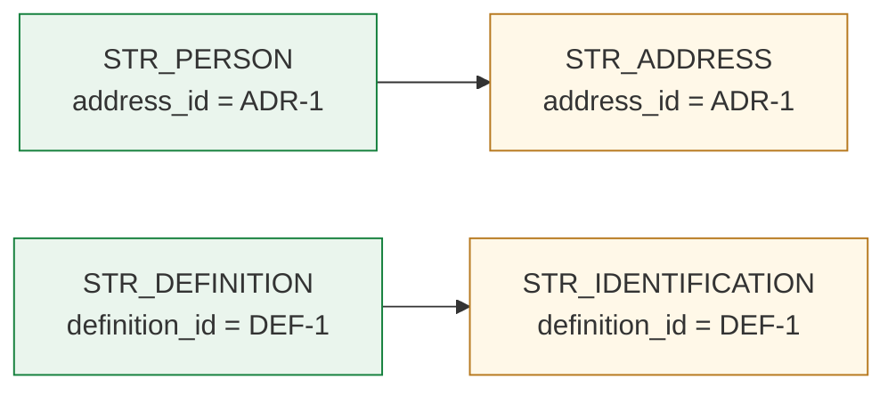

La personne, l’entité ou un autre propriétaire prévu possède un `address_id` facultatif. Une adresse appartient à un seul propriétaire dans la version. Les pièces d’identification sont rattachées à la définition.

**Différence avec l’ancien document :** projetdod n’utilise pas le couple générique `owner_type / owner_id` pour ces liens. Il utilise les clés explicites du [modèle actuel](docs/ANALYSE.md#adresses-comptes-et-listes). Le contrôle d’un seul propriétaire d’adresse, y compris entre tables différentes, reste à implanter.

### Que signifiait `owner_type` dans l’ancien projet ?

Une ligne `owner_type=PERSON, owner_id=601` demandait de chercher le propriétaire 601 dans PERSON. Avec `owner_type=EMPLOYER`, le même champ `owner_id` désignait une ligne d’EMPLOYER_INFO. **La table cible changeait selon le code** : c’est cela, la FK polymorphe.

Ce mécanisme est compact, mais une FK relationnelle ordinaire référence une table cible déterminée. Vérifier une référence qui peut viser plusieurs tables demande donc un contrôle supplémentaire. Dans projetdod, chaque propriétaire porte une FK explicite vers ADDRESS.

### Exemple concret dans le modèle actuel

**Les adresses :**

| STR_ADDRESS.address_id | str_report_id | city | country_code |
|---|---|---|---|
| 801 | R-V1 | Montréal | CA |
| 802 | R-V1 | Québec | CA |
| 803 | R-V1 | Toronto | CA |

**Les propriétaires qui les citent :**

| Table propriétaire | Clé de la ligne | address_id | Lecture |
|---|---|---|---|
| STR_PERSON | person_id = 601 | 801 | L’adresse de Camille |
| STR_EMPLOYER_INFO | employer_id = 701 | 802 | L’adresse de son employeur |
| STR_DIRECTOR | director_id = 901 | 803 | L’adresse d’un administrateur |

Chaque propriétaire est lui aussi dans `R-V1`. Une adresse ne doit pas être réutilisée par plusieurs propriétaires dans cette version. Deux personnes qui habitent au même endroit peuvent avoir deux lignes d’adresse ayant les mêmes valeurs : **même lieu ne signifie pas même ligne de propriété** dans ce modèle.

Pour IDENTIFICATION, la clé portée par la pièce est `definition_id`. La définition permet ensuite de savoir s’il s’agit d’une personne ou d’une entité; on n’ajoute pas de `owner_type` à cette table.

### Pourquoi garder une table d’adresse commune ?

| Option | Ce qu’elle facilite | Ce qu’elle demande |
|---|---|---|
| Une table d’adresse par type de propriétaire | Des références distinctes par table | Répéter et maintenir plusieurs fois les colonnes d’adresse |
| Une table ADDRESS avec `owner_type / owner_id` | Une structure d’adresse et un couple de rattachement | Contrôler une cible qui change de table selon le code |
| **Une table ADDRESS et une FK sur chaque propriétaire — modèle actuel** | Une structure commune et des FK vers une cible déterminée | Contrôler l’unicité du propriétaire entre toutes les tables et l’appartenance à la même version |

Le Swagger décrit des objets JSON réutilisables. Le placement des FK est un **choix de stockage du projet**, pas une obligation imposée par la réutilisation du schéma d’adresse.

### Un compte : choisir l’action à laquelle il appartient

Le besoin est similaire : ACCOUNT peut appartenir à une action initiale ou à une action finale. L’ancien support proposait `action_type / action_id`. Le code STARTING ou COMPLETING indiquait alors dans quelle table chercher l’identifiant.

Le modèle actuel possède deux colonnes explicites, `starting_action_id` et `completing_action_id`, avec une règle d’exclusivité : **exactement une des deux contient une valeur**. On appelle parfois cette règle un « OU exclusif », ou XOR.

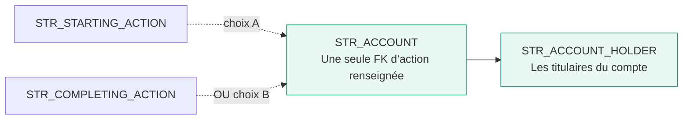

| Rattachement du compte | `starting_action_id` | `completing_action_id` |
|---|---|---|
| Action initiale A | Identifiant de A | Vide |
| Action finale B | Vide | Identifiant de B |

Remplir les deux clés, ou les laisser toutes les deux vides, ne respecte pas le modèle. Cette alternative s’applique aussi à `STR_VC_DATA`. Chaque action peut avoir au plus un compte, mais plusieurs données de monnaie virtuelle.

### Exemple de lignes et contrôles

| account_id | str_report_id | starting_action_id | completing_action_id | Résultat |
|---|---|---|---|---|
| 701 | R-V1 | A-1 | Vide | Valide : le compte appartient à l’action initiale A-1 |
| 702 | R-V1 | Vide | B-1 | Valide : le compte appartient à l’action finale B-1 |
| 703 | R-V1 | A-1 | B-1 | Invalide : deux parents sont renseignés |
| 704 | R-V1 | Vide | Vide | Invalide : aucun parent n’est renseigné |

Ces lignes sont des cas indépendants pour expliquer la règle; elles ne forment pas un jeu de données à charger ensemble. Les actions citées doivent exister dans `R-V1`. Un même numéro de compte réel peut apparaître dans des actions différentes : chaque ligne conserve le contexte de l’action concernée.

| Point de comparaison | Ancien support | Projet actuel |
|---|---|---|
| Colonnes de rattachement | `action_type` et `action_id` | Deux FK nommées selon l’action |
| Choix de la table cible | Dépend du code STARTING/COMPLETING | Dépend de la FK renseignée |
| Contrôle essentiel | Identifier puis vérifier la bonne table cible | Vérifier chaque FK et imposer une seule valeur |
| Pourquoi cette règle ? | Savoir à quelle action appartient le compte | Même objectif, avec des cibles de FK explicites |

Dans VC_DATA, `data_type` distingue les identifiants de transactions, les adresses émettrices et les adresses réceptrices. `ordinal` garde la position dans la liste. Dans le modèle actuel, on n’utilise pas `action_type / action_id` pour choisir le parent.

## 6. Comprendre la direction et la propriété

### Le besoin métier

Décrire le nom d’une organisation ne dit pas qui la dirige, qui en détient des actions ou qui intervient dans une fiducie. Les sept tables du domaine « Bénéficiaires effectifs » rangent ces renseignements séparément. Elles correspondent aux listes de la définition d’entité de **type 6** et se rattachent à **STR_ENTITY par `entity_id`**, dans la même version.

Le nom historique du domaine regroupe aussi des renseignements de direction. Être administrateur, détenteur d’actions ou bénéficiaire d’une fiducie ne désigne pas le même rôle.

### Arbre de lecture — quelles listes regarder ?

L’arbre ci-dessous **oriente la lecture selon la structure de l’entité**. Il ne signifie pas qu’il faut inventer une ligne dans chaque table, ni qu’il suffit à déterminer toutes les obligations de déclaration. Pour le type 6, le JSON conserve les sept listes requises, y compris celles qui sont vides lorsque le contrat l’autorise.

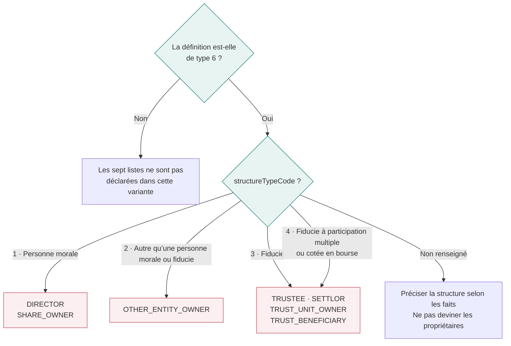

Les codes et libellés viennent de [structureTypeCode](source/swaggerExternal.yaml#L5861). Le code 4 ne signifie pas simplement « fiducie publique ». Le schéma archivé énumère les codes, mais ne définit pas une condition JSON qui imposerait automatiquement de remplir telle liste avec au moins une ligne selon le code.

### Les sept listes, une par une

| Liste JSON du type 6 | Table, préfixe STR_ omis | Ce qu’on y décrit | Forme des renseignements |
|---|---|---|---|
| `directorsOfCorporation` | DIRECTOR | Administrateurs | Nom et coordonnées possibles |
| `personsOwningSharesOfCorporation` | SHARE_OWNER | Personnes détenant des actions | Nom seulement |
| `trusteesOfTrust` | TRUSTEE | Fiduciaires | Nom et coordonnées possibles |
| `settlorsOfTrust` | SETTLOR | Constituants de la fiducie | Nom et coordonnées possibles |
| `personsOwningUnitsOfTrust` | TRUST_UNIT_OWNER | Personnes détenant des unités | Nom et coordonnées possibles |
| `beneficiariesOfTrust` | TRUST_BENEFICIARY | Bénéficiaires de la fiducie | Nom et coordonnées possibles |
| `personsOwningEntityNotCorporationOrTrust` | OTHER_ENTITY_OWNER | Propriétaires d’une autre forme d’entité | Nom seulement |

### Pourquoi certaines tables ont-elles plus de colonnes ?

Le Swagger réutilise la forme `personContact` dans cinq listes. Les deux autres déclarent seulement les trois propriétés de nom.

| Propriété JSON | Forme avec coordonnées | Forme de nom seulement |
|---|:---:|:---:|
| `surname` | ✅ | ✅ |
| `givenName` | ✅ | ✅ |
| `otherNameInitial` | ✅ | ✅ |
| `addressTypeCode` | ✅ | — |
| `address {}` | ✅ | — |
| `telephoneNumber` | ✅ | — |
| `extensionNumber` | ✅ | — |

Les coches désignent encore les propriétés disponibles, pas des valeurs toutes obligatoires. Le modèle ne rajoute pas une adresse à SHARE_OWNER au motif que d’autres propriétaires en ont une. Source : [listes de propriété](source/swaggerExternal.yaml#L5883) et [personContact](source/swaggerExternal.yaml#L5940).

### Exemple — une organisation, deux informations distinctes

Toutes les lignes suivantes appartiennent à `R-V1`; les autres colonnes sont omises.

| Table | Clé | Parent | Renseignements fictifs | Interprétation |
|---|---|---|---|---|
| STR_ENTITY | entity_id = 801 | Une définition de type 6 | Société A, structure_type_code = 1 | L’organisation décrite |
| STR_DIRECTOR | director_id = 901 | entity_id = 801 | Samira, address_id = 803 | Une administratrice de la société A |
| STR_SHARE_OWNER | share_owner_id = 902 | entity_id = 801 | Alex | Une personne détenant des actions de A |

Ce sont deux listes distinctes. Être administratrice ne permet pas de conclure automatiquement que Samira détient des actions. On crée une ligne dans chaque liste correspondant aux faits connus, en conservant le rang `ordinal` pour reconstruire l’ordre déclaré.

Ces listes portent directement des noms et, selon la liste, des coordonnées. Elles ne citent pas les fiches DEFINITION par `refId`. **Le bénéficiaire d’une fiducie et le bénéficiaire d’une opération sont deux notions différentes.**

### Les trois mécanismes à retenir

| Mécanisme | Question simple | Mise en œuvre dans projetdod |
|---|---|---|
| `type_code` | Quelle forme de fiche décrit-on ? | Une définition et une PERSON ou ENTITY; champs applicables selon le code |
| Adresse commune | À qui appartient cette adresse ? | Un `address_id` sur le propriétaire, et un contrôle d’unicité de propriété |
| Action alternative | À quelle action appartient ce compte ? | Une seule FK renseignée parmi `starting_action_id` et `completing_action_id` |

Seul le premier reprend directement les six variantes du contrat JSON. Les deux autres sont des choix relationnels destinés à stocker les objets et à rendre leurs rattachements explicites.

## 7. Séparer les versions et les envois

**Une correction change le contenu. Une nouvelle tentative ou une consultation ajoute une trace d’appel.**

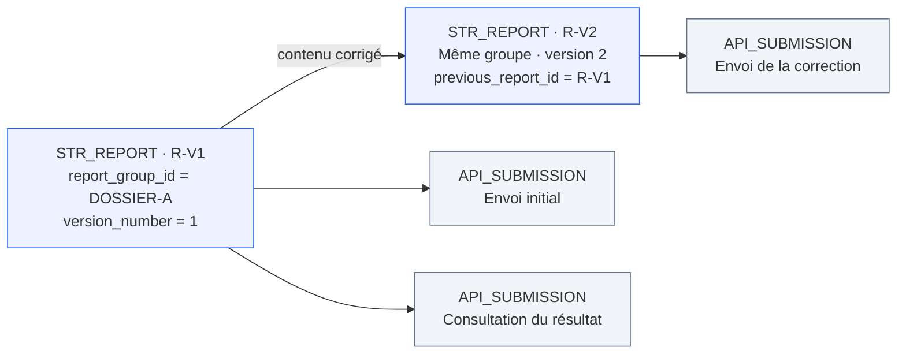

Chaque version a son propre `str_report_id`. Les deux versions partagent `report_group_id`. Une correction recrée aussi ses lignes enfants et leurs clés; elle ne reprend pas les liens internes vers les enfants de l’ancienne version.

| Information à retrouver | Où la chercher ? |
|---|---|
| Contenu exact envoyé | STR_SUBMITTED_PAYLOAD |
| Appel, réponse complète et résultat suivi | STR_API_SUBMISSION |
| Erreurs ou avertissements consultables | STR_VALIDATION_ERROR |
| Décisions et actions internes | STR_AUDIT_EVENT |

Un statut HTTP positif ne prouve pas à lui seul l’acceptation du rapport. Après une interruption réseau, il faut rechercher le résultat avant de retransmettre. Les anciennes réponses et les anciens contenus restent conservés.

Ce schéma illustre les choix d’historisation du modèle; ce n’est pas un calendrier réglementaire. [Extrait de lignes fictives](examples/parcours-metier.json) · [Alimentation et versions](docs/ALIMENTATION.md).

## 8. Retrouver le Swagger derrière une colonne

Prenons le prénom de Camille. Dans le document JSON, il se trouve dans une définition, sous `givenName`. Dans le modèle, il est rangé dans `STR_PERSON.given_name`.

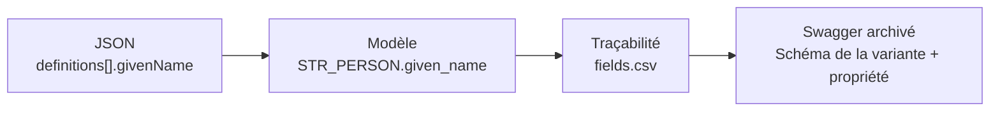

Une même colonne peut correspondre à plusieurs lignes de traçabilité, car le prénom existe dans plusieurs variantes de personne. À l’inverse, une clé de stockage comme `person_id` est un choix interne et n’est pas une propriété à envoyer à CANAFE.

Pour justifier une colonne, ouvrir le [dictionnaire](docs/DICTIONNAIRE.md), puis retrouver son chemin dans [fields.csv](traceability/fields.csv). Les contraintes viennent du [Swagger archivé](source/swaggerExternal.yaml); les règles ajoutées pour les versions, les clés et l’audit sont distinguées dans [REGLES.md](docs/REGLES.md).

## Une façon simple de le présenter aux collègues

« Nous préparons une version du rapport. Nous décrivons les personnes et les organisations, puis les opérations. Chaque rôle cite la fiche appropriée dans cette version. Les comptes et les adresses ont des rattachements explicites. Enfin, nous gardons le contenu envoyé et les réponses, afin de distinguer une correction d’un nouvel appel. »

Pour approfondir : [guide métier](docs/GUIDE_METIER.md), [comparaison avec projet-io](docs/COMPARAISON_PROJET_IO.md), [registre des relations](docs/RELATIONS.md).
