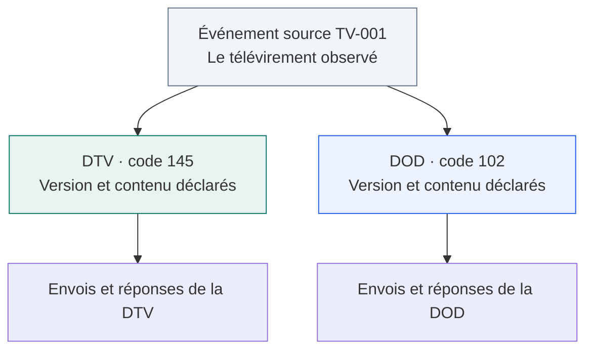
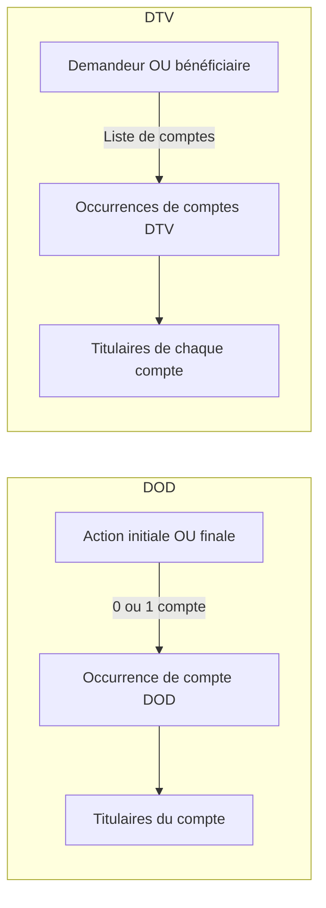
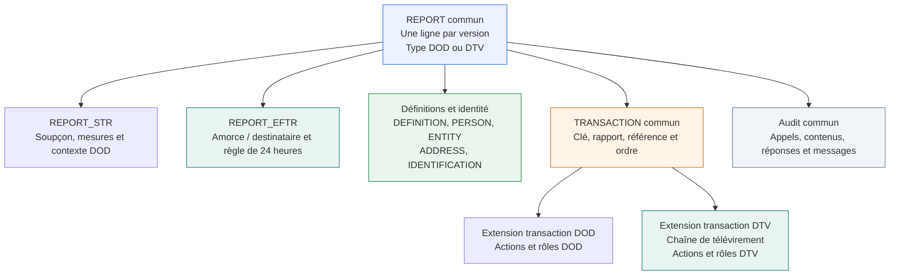

# Un modèle commun pour les DOD et les DTV : analyse de faisabilité

**Oui. La solution recommandée est un modèle commun avec un socle partagé et des extensions propres à chaque déclaration.** Le modèle DOD actuel fournit une bonne base, mais ajouter `report_type_code=145` aux tables existantes ne suffirait pas.

Dans ce document, **DTV** désigne la déclaration de télévirements, appelée **EFTR** dans le Swagger. La DOD correspond à **STR**. Leurs codes sont respectivement **145** et **102**.

Cette analyse propose une architecture. Elle ne modifie ni les 34 tables, ni le dictionnaire, ni les fichiers draw.io du modèle DOD livré. Les noms des nouvelles tables ci-dessous sont des propositions, à confirmer pendant la conception détaillée.

## 1. Ce qui a été examiné

L’analyse compare `STRReport`, `EFTRReport`, leurs variantes de définition, leurs rôles et leurs comptes dans le [Swagger archivé](../source/swaggerExternal.yaml). Le fichier officiel a été téléchargé de nouveau le **23 septembre 2026** : son empreinte est identique à celle de la copie du dépôt.

`SHA-256 : 78a49aa716180d4b0a3049e76af3ae3b06a188c2bafb789b11d31ddc9edf17f0`

La comparaison a été recoupée avec le [schéma JSON officiel DTV](https://fintrac-canafe.canada.ca/reporting-declaration/info/api/validation/eftr-schema.json), la [page des ressources API](https://fintrac-canafe.canada.ca/reporting-declaration/info/api/api-fra) et les [directives DTV](https://fintrac-canafe.canada.ca/guidance-directives/transaction-operation/eft-dt/eft-dt-fra). Les [règles de validation DTV](https://fintrac-canafe.canada.ca/reporting-declaration/info/api/validation/eftr-dtr-fra) constituent une source supplémentaire à intégrer au mapping détaillé; elles n’ont pas toutes été analysées règle par règle ici.

**Portée du résultat :** les écarts structurels et la stratégie de partage sont établis. Le nombre final de tables et la traçabilité complète de toutes les colonnes DTV restent à produire. Un pourcentage de réutilisation serait prématuré sans ce travail.

## 2. Un événement peut conduire à deux déclarations

Une DTV et une DOD n’ont pas le même objet. La DTV décrit un télévirement répondant à ses critères de déclaration. La DOD décrit des faits et des opérations associés à un soupçon. CANAFE précise qu’une même opération peut donner lieu aux deux déclarations. [Directive DTV, section sur les opérations douteuses](https://fintrac-canafe.canada.ca/guidance-directives/transaction-operation/eft-dt/eft-dt-fra).

**Exemple fictif :** le télévirement `TV-001` est repris dans une DTV. Il fait aussi partie d’un ensemble d’opérations documenté dans une DOD. Les deux rapports peuvent provenir des mêmes données sources, mais ils ont leurs propres références, variantes de fiches, versions et envois.

**Conséquence :** partager une structure de table ne signifie pas partager une ligne déclarative modifiable entre deux rapports. Chaque contenu gelé doit rester reconstituable. Une correction de la DTV ne doit pas modifier silencieusement la DOD.

Si un rapprochement entre déclarations est nécessaire, conserver les références des systèmes sources et une association entre événement source et opération déclarée. Ne pas supposer une correspondance une pour une : une DOD peut couvrir plusieurs événements et un événement peut apparaître dans plusieurs déclarations. Cette association interne ne doit pas être envoyée dans le JSON sans propriété prévue par le contrat.

## 3. Comparaison des structures

| Sujet | DOD / STR | DTV / EFTR | Conséquence sur le modèle |
|---|---|---|---|
| Identité du rapport | Entité déclarante, référence, code de déclaration et de soumission | Même noyau | Socle REPORT commun |
| Contenu particulier du rapport | Soupçon, mesures prises, projets PPP, références liées | Mode de déclaration et objet de règle de 24 heures | Extensions de rapport distinctes |
| Variantes de définition | Types **1, 2, 3, 4, 5, 6** | Types **1, 2, 3, 4, 7, 8, 9, 10** | Catalogue commun avec autorisations par type de rapport |
| Personnes et entités | Fiches PERSON et ENTITY | Mêmes concepts et quatre schémas de définition réutilisés | Tables communes possibles; règles de projection par variante |
| Actions | Initiales et finales; listes sans minimum d’éléments déclaré dans STRReport | Initiales et finales avec `minItems: 1` | Ne pas partager aveuglément les validations de cardinalité |
| Exécutant / demandeur | CONDUCTOR, types 5/6 | REQUESTER, types 3/4 | Deux rôles distincts |
| Chaîne de télévirement | Pas de structure équivalente complète | Initiator, senders, involvements au niveau transaction, receiver | Extension DTV indispensable |
| Comptes | Un objet compte facultatif dans les détails d’une action | Listes de comptes dans les détails du demandeur et du bénéficiaire | Parents et cardinalités différents |
| Tiers représenté | Sous un exécutant | Sous un demandeur ou un bénéficiaire | Parents et codes de définition différents |
| Audit | Appels, documents exacts, réponses, messages et événements | Même besoin | Infrastructure commune, traitement par type de rapport |

Sources structurelles : [STRReport](../source/swaggerExternal.yaml#L1311), [EFTRReport](../source/swaggerExternal.yaml#L1847), [strAccount](../source/swaggerExternal.yaml#L6144), [eftrAccount](../source/swaggerExternal.yaml#L6195).

### Attention au mot « direction »

Dans la DTV, `reportDetails.eftDirectionCode` vaut **1 pour Amorce** et **2 pour Destinataire**. Cela décrit la position déclarée dans le télévirement. Ce n’est pas le même code que `STRReport.transactions[].startingActions[].details.direction`, qui décrit une entrée ou une sortie.

Il faut garder des attributs distincts, même si tous deux sont des nombres 1 ou 2. Le nom `direction` seul serait trop ambigu dans un modèle commun. [Direction DTV](../source/swaggerExternal.yaml#L1872), [direction d’action DOD](../source/swaggerExternal.yaml#L1493).

## 4. Les définitions : un partage possible, avec des règles précises

| Code de définition | Forme | DOD | DTV |
|---:|---|:---:|:---:|
| 1 | Nom de personne | Oui | Oui |
| 2 | Nom d’entité | Oui | Oui |
| 3 | Détails de personne | Oui | Oui |
| 4 | Détails d’entité | Oui | Oui |
| 5 | Personne avec employeur possible | Oui | Non |
| 6 | Entité avec direction et propriété | Oui | Non |
| 7 | Nom et adresse de personne | Non | Oui |
| 8 | Nom et adresse d’entité | Non | Oui |
| 9 | Détails de base de personne | Non | Oui |
| 10 | Détails de base d’entité | Non | Oui |

Les types 7 à 10 n’imposent pas quatre nouvelles tables de personnes et d’entités. Ils peuvent utiliser PERSON et ENTITY, avec les colonnes applicables à leur variante. En revanche, les identifications des types 9/10 ne reprennent pas exactement les schémas avec juridiction utilisés dans les variantes détaillées : la reconstruction JSON doit sélectionner les propriétés correctes.

La nouvelle règle serait : **la variante est autorisée par le type de rapport, puis le rôle est autorisé à citer cette variante**. Autoriser globalement les codes 1 à 10 sans vérifier le type de rapport ferait accepter des fiches incompatibles avec le document à produire.

Exemples :

- L’exécutante d’une DOD peut citer une fiche de Camille de type 5.
- La demandeuse d’une DTV cite une fiche de type 3, même s’il s’agit de Camille dans le même événement réel.
- La DTV ne doit pas reprendre la définition de type 5 de la DOD telle quelle.

**Le cas 0 mérite un traitement distinct.** Les rôles DTV initiator et receiver admettent le code 0, « sans objet ». Ce n’est pas une onzième variante de DEFINITION. La référence de fiche doit suivre les règles conditionnelles de ce rôle; on ne doit pas créer une définition fictive de type 0 pour satisfaire une FK obligatoire. Le contrat exige `typeCode` et `details`, mais ne rend pas `refId` inconditionnellement requis sur ces deux rôles.

Sources : [variantes DOD](../source/swaggerExternal.yaml#L1412), [variantes DTV à la racine](../source/swaggerExternal.yaml#L2365), [formes 7 à 10](../source/swaggerExternal.yaml#L5399), [codes de rôle 0/1/2/7/8](../source/swaggerExternal.yaml#L6543).

## 5. Les rôles : mêmes mots, contextes parfois différents

| Rôle ou chemin DTV | Parent réel | Types de définition prévus | Traitement proposé |
|---|---|---|---|
| `initiator` | Transaction | 0, 1, 2, 7, 8 | Rôle DTV spécifique |
| `receiver` | Transaction | 0, 1, 2, 7, 8 | Rôle DTV spécifique |
| `senders[]` | Transaction | 7, 8 | Liste ordonnée DTV |
| `involvements[]` | Transaction | 7, 8 | Intervenants de la chaîne DTV |
| `startingActions[].sourcesOfFunds[]` | Action initiale | 1, 2 | Concept commun, rattachement DTV explicite |
| `startingActions[].requesters[]` | Action initiale | 3, 4 | Demandeurs DTV, distincts des exécutants DOD |
| `requesters[].otherAccountHolders[]` | Demandeur | 3, 4 | Liste DTV distincte des titulaires du compte |
| `requesters[].onBehalfOfs[]` | Demandeur | 3, 4, 9, 10 | Tiers représentés du demandeur |
| `completingActions[].beneficiaries[]` | Action finale | 3, 4 | Bénéficiaires DTV avec comptes et tiers représentés |
| `beneficiaries[].onBehalfOfs[]` | Bénéficiaire | 3, 4, 9, 10 | Tiers représentés du bénéficiaire |
| `completingActions[].involvements[]` | Action finale | 1, 2 | Participation à l’action, distincte de l’involvement de transaction |
| `accounts[].holders[]` | Compte | 1, 2 | Titulaires du compte |

Le Swagger DTV contient donc deux listes `involvements` placées à des niveaux différents, avec des types de fiches différents. Une seule table nommée INVOLVEMENT sans distinction de parent et de contexte ferait perdre cette différence.

De même, `otherAccountHolders[]` dépend du demandeur. Le JSON ne permet pas de l’associer arbitrairement à un seul compte parmi `requesters[].details.accounts[]`. Il faut préserver ce rattachement au demandeur.

**Recommandation :** conserver des rôles nommés et des FK explicites dans chaque extension. Éviter, pour cette première évolution, une table universelle ROLE avec un `owner_type / owner_id` qui peut viser n’importe quelle table. Cela rendrait les contrôles et la présentation beaucoup plus difficiles.

## 6. Les comptes : le principal changement de parent

Les attributs de base — numéro, institution, succursale, type, devise — sont proches. Mais DOD et DTV ne mettent pas le compte au même endroit. Le compte DTV possède aussi `referenceNumber` et `otherRelatedReferenceNumber`; le compte DOD prévoit notamment la date de fermeture et des attributs de monnaie virtuelle absents de `eftrAccount`.

Un partage possible, à concevoir en détail :

| Table proposée | Fonction |
|---|---|
| ACCOUNT | Attributs communs et identifiant de version du rapport |
| STR_ACCOUNT_DETAIL | Une extension par compte DOD; FK vers une action initiale **ou** finale; champs DOD |
| EFTR_ACCOUNT_DETAIL | Une extension par compte DTV; FK vers un demandeur **ou** un bénéficiaire; rang dans la liste; champs DTV |
| ACCOUNT_HOLDER | Titulaires de codes 1/2 rattachés à un compte |

Un compte possède exactement l’extension correspondant au type de son rapport. Chaque extension impose un seul parent. Pour DOD, l’unicité par action reste contrôlée; pour DTV, plusieurs occurrences sont permises et leur ordre est conservé.

Cette organisation partage les colonnes communes tout en conservant des liens lisibles. Garder deux tables de comptes complètes au départ est aussi une option raisonnable si l’objectif immédiat est de réduire le risque de migration; leur rapprochement peut venir ensuite.

## 7. Architecture recommandée

### Le socle commun

- **REPORT** reprend le principe actuel de STR_REPORT : `report_id` identifie une version, `report_group_id` un groupe de versions. Il porte `report_type_code`, `version_number`, `previous_report_id` et les renseignements communs du déclarant. Une chaîne de versions ne change pas de type de déclaration.
- **REPORT_STR / REPORT_EFTR** ont une PK également FK vers REPORT. Une version a exactement une extension, cohérente avec son type. La simple existence d’une FK ne suffit pas à imposer cette exclusivité : cette règle doit être conçue et contrôlée.
- **DEFINITION, PERSON, ENTITY, ADDRESS, IDENTIFICATION** partagent leur structure de stockage. Leurs lignes restent propres à une version déclarative. L’unicité de `ref_id` est conservée par version; les références vérifient aussi le type de fiche attendu.
- **TRANSACTION** partage une identité déclarative minimale et son rattachement au rapport. Les données propres à chaque déclaration vont dans une extension du même type que le rapport. Les dates de la DOD et la date-heure avec décalage de la DTV ne doivent pas être fusionnées au prix d’une perte d’information.
- **API_SUBMISSION, SUBMITTED_PAYLOAD, VALIDATION_ERROR, AUDIT_EVENT** deviennent communs. Chaque appel et résultat reste rattaché à la bonne version et au bon environnement. Les chemins d’erreur et les règles de validation restent propres au document concerné.

Les actions initiales/finales et les rôles peuvent rester dans les extensions DOD et DTV pendant la première conception. Il n’est pas nécessaire de créer une table d’action universelle pour partager utilement les rapports, fiches, comptes et transmissions.

### Ce qui reste propre à la DOD

Le récit du soupçon, les mesures prises, les projets PPP, les références déclaratives liées, l’exécutant et ses tiers représentés, les variantes 5/6 et les listes de direction/propriété restent soumis au contrat DOD. Le domaine « Bénéficiaires effectifs » n’est pas automatiquement alimenté pour une DTV.

### Ce qui s’ajoute pour la DTV

L’extension DTV porte notamment :

- Le code Amorce/Destinataire et l’objet de règle de 24 heures, avec ses critères et sa période.
- Les détails de télévirement : SWIFT ou non-SWIFT, indicateurs, références et informations de paiement additionnelles.
- L’amorceur, le destinataire, les expéditeurs et les intermédiaires, avec leurs coordonnées de chaîne comme les codes BIC/BEI.
- Les demandeurs, leurs autres titulaires de compte et leurs tiers représentés.
- Les bénéficiaires et leurs tiers représentés, leurs comptes et leurs rattachements propres.

Les cardinalités exactes, les indicateurs de présence, les codes et les règles conditionnelles doivent rester spécifiés par chemin JSON, même lorsque les colonnes sont partagées.

## 8. Impact sur les neuf domaines déjà présentés

| Domaine actuel | Évolution proposée | Effort relatif de conception |
|---|---|---|
| Rapport | Extraire le noyau commun; conserver le détail DOD; ajouter le détail DTV | Moyen |
| Définitions | Réutiliser PERSON/ENTITY; intégrer 7–10 et les contrôles par type de rapport | Moyen |
| Identité | Réutiliser les structures; contrôler les variantes d’identification et d’adresse | Moyen |
| Entité | Réutiliser enregistrement et personnes autorisées quand la variante les prévoit | Moyen |
| Bénéficiaires effectifs | Conserver les tables; applicabilité DOD de type 6 | Faible pour le périmètre DTV |
| Transactions | Identité commune minimale, extensions et nouvelles listes DTV | Élevé |
| Rôles | Ajouter la chaîne DTV, les demandeurs et les deux branches de tiers représentés | Élevé |
| Comptes | Revoir les parents, listes et extensions sans perdre la règle DOD | Élevé |
| Audit | Généraliser le rattachement; distinguer les contrats de validation | Faible à moyen |

Ces niveaux sont des appréciations de modélisation, pas des estimations en jours. Les neuf domaines peuvent rester le cadre de présentation. Le périmètre complet dépassera vraisemblablement 34 tables; conserver artificiellement ce total ne doit pas guider les choix.

## 9. Options examinées

| Option | Intérêt | Limite | Avis |
|---|---|---|---|
| Deux modèles indépendants | Migration DOD limitée; séparation simple | Double entretien des fiches, versions et transmissions | Possible pour une échéance courte |
| Ajouter toutes les colonnes DTV dans les tables STR | Réutilisation apparente rapide | Beaucoup de colonnes inapplicables; parents et cardinalités incohérents | Déconseillé |
| Un socle commun et des extensions typées | Réutilisation utile, règles distinctes, architecture explicable | Travail de découpage et de migration à préparer | **Recommandé** |
| Un modèle totalement générique de rôles et attributs | Grande souplesse apparente | Liens moins explicites, contrôles complexes, lecture métier difficile | Disproportionné pour ce besoin |

Il faut également produire **deux documents JSON**, avec deux projections et deux jeux de validations. Une même plateforme de génération est possible; son comportement doit être piloté par le type de rapport et la version de contrat.

## 10. Points techniques à traiter avant une implantation

1. **Clés de version.** Remplacer progressivement la dépendance à `str_report_id` par un identifiant neutre dans le socle. Vérifier le type de rapport et la même version dans tous les liens vers les extensions, sans mélanger DOD et DTV.
2. **Références de rôle.** Imposer les variantes autorisées par rôle et rapport. Traiter explicitement les rôles DTV avec code 0, sans créer une définition artificielle.
3. **Cardinalités et listes.** Le minimum d’une action initiale/finale en DTV est une règle de document prêt à transmettre. Il ne doit pas empêcher de préparer un brouillon incomplet. Garder les rangs, les listes requises vides autorisées et la distinction entre objet absent et objet vide.
4. **Types et domaines de valeurs.** Des noms identiques n’assurent pas des contraintes identiques. Par exemple, le numéro de compte dans les détails d’une source de fonds est référencé comme string200 en DOD et string100 en DTV. Certains codes de disposition diffèrent également.
5. **Sources techniques.** Le Swagger possède une entrée `definitions` supplémentaire sous le schéma `reportDetails` d’EFTR, hors de ses `properties`; la propriété de charge utile attendue reste à la racine, confirmée par le schéma JSON officiel. Il comporte aussi une référence `#components/schemas/string100` sans la barre oblique attendue sur `eftrAccount.otherRelatedReferenceNumber`. Ces anomalies doivent être consignées, pas transformées silencieusement en nouvelles structures de données.
6. **Lots et réponses.** Réexaminer le [schéma officiel de lot indiqué par CANAFE](https://fintrac-canafe.canada.ca/reporting-declaration/info/api/api-fra) avant de généraliser le suivi. Un résultat de lot n’est pas le résultat de chaque déclaration; les références de rapprochement restent nécessaires.

Ces points ne remettent pas en cause la faisabilité. Ils montrent pourquoi un modèle commun doit être conçu à partir des contrats détaillés, plutôt que par simple renommage des tables STR.

## 11. Trajectoire recommandée

**Étape 1 — inventorier la DTV.** Produire la même traçabilité que pour la DOD : chemins JSON, types, champs requis, listes, variantes, codes et règles. Marquer chaque élément « commun », « extension » ou « spécifique ».

**Étape 2 — dessiner la cible séparément.** Créer un nouveau diagramme DOD+DTV, avec une vue métier commune et deux vues de détail. Garder les fichiers DOD actuels comme référence. Stabiliser les clés et le propriétaire de chaque liste avant de compter les tables.

**Étape 3 — démontrer la reconstruction.** Utiliser les exemples officiels DTV d’amorce simple, d’opérations multiples, de destinataire avec intermédiaires et de destinataire avec opérations multiples. Vérifier aussi la correction d’une DOD et d’une DTV, les références de fiche de types différents, les comptes multiples et les rôles sans définition applicable. Contrôler les JSON reconstruits contre les schémas et les règles retenus.

**Étape 4 — préparer la migration.** Définir la correspondance des anciennes clés STR vers le socle commun; conserver les versions, rangs, références déclaratives, archives exactes et empreintes. Vérifier que chaque ancien rapport peut être reconstruit avant d’adopter la cible.

**Décision proposée :** engager la conception d’un modèle commun à extensions, en réutilisant les domaines existants. La priorité est la frontière entre socle commun, rôles et comptes; elle conditionne la simplicité du reste du modèle.
