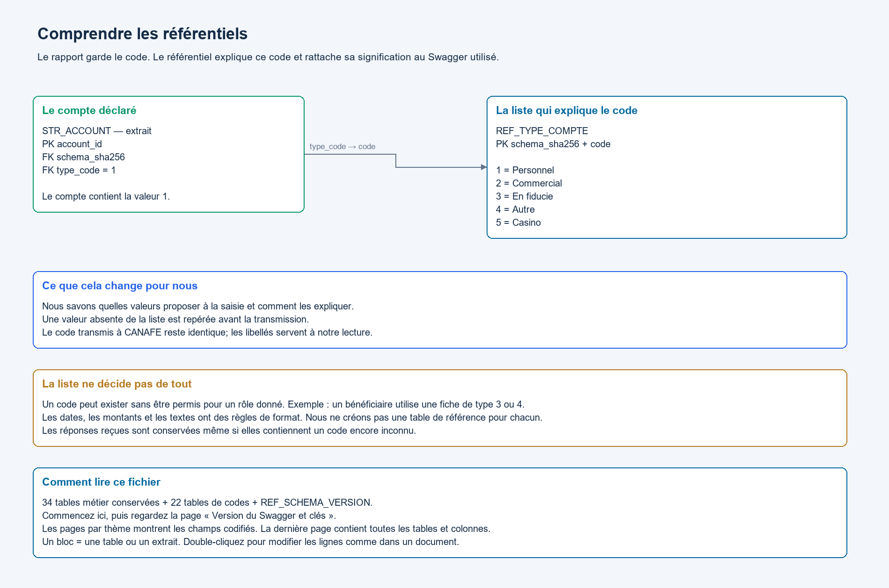

# DOD avec référentiels CANAFE

Ce nouveau modèle complète les 34 tables métier. Les fichiers draw.io précédents restent inchangés. Les référentiels sont un ajout de conception interne : CANAFE fournit les codes et les règles, pas ces tables relationnelles.

**34 tables métier + 22 tables de codes + 1 table de version = 57 tables.** Les 365 colonnes initiales sont conservées; cette édition ajoute 24 colonnes internes de contrôle aux tables métier. Aucun script de création de tables n’est fourni.

## À quoi servent ces listes ?

Un compte contient par exemple `type_code = 1`. La liste explique que 1 signifie « Personnel ». Le code transmis ne change pas; nous ajoutons sa signification et la preuve de sa provenance.

## Parcours de lecture du draw.io

| Page | Contenu |
|---|---|
| 1 | Comprendre les référentiels |
| 2 | Version du Swagger et clés |
| 3 | Rapport — champs et listes |
| 4 | Définitions — champs et listes |
| 5 | Identité — champs et listes |
| 6 | Entité — champs et listes |
| 7 | Bénéficiaires effectifs — champs et listes |
| 8 | Transactions — champs et listes |
| 9 | Rôles — champs et listes |
| 10 | Comptes — champs et listes |
| 11 | Catalogue des listes · 1 |
| 12 | Catalogue des listes · 2 |
| 13 | Catalogue des listes · 3 |
| 14 | Catalogue des listes · 4 |
| 15 | Modèle complet — toutes les tables et colonnes |

Les pages par thème montrent des extraits; une table répétée reste la même table. La dernière page rassemble les 365 colonnes initiales, les ajouts et tous les référentiels. Les liens métier existants restent disponibles. Les liens de codes et de versions sont dans deux nouveaux calques masqués au départ : **Vue > Calques**. Cette séparation garde les traits lisibles pendant une présentation.

## Quelles clés utilise-t-on ?

Chaque table de codes a pour clé primaire `(schema_sha256, code)`. Le code conserve son type d’origine : entier ou texte. Un code de devise et un code de type de compte ne vont pas dans la même table.

La table métier référence cette clé avec `(schema_sha256, champ_code)`. `schema_sha256` est une FK de `STR_REPORT` vers `REF_SCHEMA_VERSION`. Les tables métier enrichies la portent également. Leur FK `(str_report_id, schema_sha256)` vers le couple unique du rapport impose la même copie du Swagger. Ces colonnes sont internes : elles ne figurent jamais dans le JSON transmis.

Les listes sont immuables pour une empreinte donnée. Une nouvelle copie du Swagger crée un nouveau jeu de valeurs; les anciennes lignes sont conservées. `archived_on` est la date d’archivage, **pas** une date d’entrée en vigueur inventée.

Les brouillons peuvent être incomplets. Au gel, la version de schéma est renseignée partout où elle est requise. Une colonne de code facultative reste facultative; l’ajout d’un référentiel ne la rend pas obligatoire. Pour un code non nul, les autres composants de sa FK doivent être présents : ne pas laisser une clé composite partiellement nulle contourner la validation.

### Le cas des pièces d’identité

Le code 1 signifie « Certificat de naissance » pour une personne et « Acte d’association » pour une entité. Une fusion sur le code seul serait fausse. `REF_TYPE_IDENTIFICATION` utilise donc `(schema_sha256, identification_family, code)`. La famille interne vaut `PERSON` ou `ENTITY`; elle se déduit du type de `STR_DEFINITION` propriétaire. La règle de cohérence avec cette définition doit être contrôlée séparément.

## Les nouvelles colonnes dans les tables métier

| Table | Colonne | Pourquoi |
|---|---|---|
| `STR_ACCOUNT` | `schema_sha256` | Figer la version de la liste et imposer la même version que le rapport. |
| `STR_ACCOUNT_HOLDER` | `schema_sha256` | Figer la version de la liste et imposer la même version que le rapport. |
| `STR_ADDRESS` | `schema_sha256` | Figer la version de la liste et imposer la même version que le rapport. |
| `STR_BENEFICIARY` | `schema_sha256` | Figer la version de la liste et imposer la même version que le rapport. |
| `STR_COMPLETING_ACTION` | `schema_sha256` | Figer la version de la liste et imposer la même version que le rapport. |
| `STR_CONDUCTOR` | `schema_sha256` | Figer la version de la liste et imposer la même version que le rapport. |
| `STR_DEFINITION` | `schema_sha256` | Figer la version de la liste et imposer la même version que le rapport. |
| `STR_DIRECTOR` | `schema_sha256` | Figer la version de la liste et imposer la même version que le rapport. |
| `STR_EMPLOYER_INFO` | `schema_sha256` | Figer la version de la liste et imposer la même version que le rapport. |
| `STR_ENTITY` | `schema_sha256` | Figer la version de la liste et imposer la même version que le rapport. |
| `STR_IDENTIFICATION` | `schema_sha256` | Figer la version de la liste et imposer la même version que le rapport. |
| `STR_INVOLVEMENT` | `schema_sha256` | Figer la version de la liste et imposer la même version que le rapport. |
| `STR_ON_BEHALF_OF` | `schema_sha256` | Figer la version de la liste et imposer la même version que le rapport. |
| `STR_PERSON` | `schema_sha256` | Figer la version de la liste et imposer la même version que le rapport. |
| `STR_PPP_PROJECT` | `schema_sha256` | Figer la version de la liste et imposer la même version que le rapport. |
| `STR_REGISTRATION_INCORPORATION` | `schema_sha256` | Figer la version de la liste et imposer la même version que le rapport. |
| `STR_SETTLOR` | `schema_sha256` | Figer la version de la liste et imposer la même version que le rapport. |
| `STR_SOURCE_OF_FUNDS` | `schema_sha256` | Figer la version de la liste et imposer la même version que le rapport. |
| `STR_STARTING_ACTION` | `schema_sha256` | Figer la version de la liste et imposer la même version que le rapport. |
| `STR_TRANSACTION` | `schema_sha256` | Figer la version de la liste et imposer la même version que le rapport. |
| `STR_TRUSTEE` | `schema_sha256` | Figer la version de la liste et imposer la même version que le rapport. |
| `STR_TRUST_BENEFICIARY` | `schema_sha256` | Figer la version de la liste et imposer la même version que le rapport. |
| `STR_TRUST_UNIT_OWNER` | `schema_sha256` | Figer la version de la liste et imposer la même version que le rapport. |
| `STR_IDENTIFICATION` | `identification_family` | Distinguer les deux significations possibles du même code de document. Dérivé du type de la définition propriétaire. |

## Dictionnaire des référentiels

Toutes les tables de codes utilisent les colonnes ci-dessous. `identification_family` n’existe que dans `REF_TYPE_IDENTIFICATION`. Les colonnes de métadonnées ne sont pas transmises à CANAFE.

| Colonne | Clé / type | Pourquoi |
|---|---|---|
| `schema_sha256` | PK + FK, texte | Conserver la copie exacte du Swagger. Clé de version; n’est jamais envoyée à CANAFE. |
| `code` | PK, type JSON du domaine | Conserver exactement la valeur et le type JSON attendus par la CANAFE. |
| `identification_family` | PK, texte (identification uniquement) | Séparer les documents PERSON et ENTITY. Ce discriminant interne évite de confondre deux codes identiques. |
| `libelle_fr` | Texte | Lire la signification française publiée; vide si la source ne la fournit pas. |
| `libelle_en` | Texte | Conserver le libellé anglais publié pour rapprochement avec la source. |
| `source_pointer` | Texte | Retrouver l’enum qui contient ce code dans le Swagger archivé. |
| `libelle_source_pointer` | Texte | Retrouver la description qui donne le libellé, parfois distincte du discriminant inline. |

### REF_SCHEMA_VERSION

| Colonne | Pourquoi |
|---|---|
| `schema_sha256` | Identifiant immuable calculé sur le fichier Swagger archivé. |
| `openapi_version` | Version du format OpenAPI (3.0.0 dans cette copie). |
| `api_version` | Version déclarée par info.version. Elle ne remplace pas l’empreinte du fichier. |
| `archived_on` | Date d’archivage dans le projet, pas une date d’entrée en vigueur réglementaire. |
| `source_url` | Adresse officielle d’où provient le fichier. |
| `archive_path` | Emplacement de la copie conservée pour pouvoir la relire. |

## Ne pas transformer toutes les contraintes en listes

- **Provinces et États** : `ProvinceStateCode` contient des listes, mais aussi une branche de texte de deux caractères. Une FK fermée sur les trois listes exclurait des valeurs décrites par cette branche. Nous ne l’imposons pas. Le chevauchement du `oneOf` reste une anomalie à confirmer, déjà recensée dans [REGLES.md](REGLES.md).
- **Réponses et archives** : les codes de retour et les contenus bruts ne sont pas bloqués par une FK de liste. Un code nouveau ou inattendu doit rester archivable. Les enums observées figurent dans le fichier de couverture.
- **Formats** : longueurs, dates, montants et motifs restent dans le dictionnaire et les contraintes du Swagger.
- **Statuts internes** : `BROUILLON`, `PRET`, etc. restent des valeurs de fonctionnement interne. Ce ne sont pas des codes CANAFE.
- **Règles conditionnelles** : existence dans la liste, présence obligatoire et validité selon le rôle sont trois contrôles différents. Cette livraison ne prétend pas convertir toutes les règles de validation officielles en tables.

## Traçabilité et listes complètes

Copie archivée : 2026-09-22. Empreinte SHA-256 : `78a49aa716180d4b0a3049e76af3ae3b06a188c2bafb789b11d31ddc9edf17f0`.

- [Swagger archivé](../source/swaggerExternal.yaml) · [Swagger officiel](https://www148.fintrac-canafe.canada.ca/swagger) · [Documentation et règles de validation officielles](https://fintrac-canafe.canada.ca/reporting-declaration/info/api/api-fra).
- [Toutes les valeurs, les libellés et leur provenance — CSV](../traceability/reference-values.csv).
- [Chaque champ vers son référentiel, sa variante et les valeurs permises — CSV](../traceability/reference-fields.csv).
- [Traitement de chaque occurrence enum du modèle — CSV](../traceability/reference-coverage.csv).
- [Modèle enrichi lisible par un outil — JSON](../model/model-with-references.json).
- [Dictionnaire des 365 colonnes existantes](DICTIONNAIRE.md).

Les libellés sont extraits des descriptions publiées, sans corriger silencieusement leurs formulations ou leurs fautes. Un champ `source_pointer` indique où se trouve le code; `libelle_source_pointer` indique où son libellé est publié. Les titres des pages et les notes sont des explications métier rédigées pour ce projet. Les listes CANAFE sont conservées telles quelles, même si elles diffèrent de référentiels ISO récents.

## REF_TYPE_RAPPORT

Type de déclaration. La liste officielle couvre plusieurs déclarations. Ici, le rapport DOD utilise uniquement le code 102.

**5 valeurs.** Type JSON du code : `integer`.

Champs concernés : `STR_REPORT.report_type_code`.

| Famille | Code | Libellé français publié | Libellé anglais publié |
|---|---|---|---|
|  | 14 | Déclaration d'opérations importantes en monnaie virtuelle (DOIMV) | Large Virtual Currency Transaction Report (LVCTR) |
|  | 102 | Décl. d'opérations douteuses (DOD) | Suspicious transaction report (STR) |
|  | 106 | Décl. d'opér. importantes en esp. (DOIE) | Large cash transaction report (LCTR) |
|  | 113 | Déclaration relative à un déboursement de casino (DDC) | Casino disbursement report (CDR) |
|  | 145 | Déclaration de télévirement | Electronic funds transfer report (EFTR) |

Source(s) : `#/components/schemas/reportTypeCode`.

## REF_TYPE_SOUMISSION

Nature de la demande. La demande et le point de terminaison doivent correspondre : 1 = soumettre, 2 = mettre à jour, 5 = supprimer.

**3 valeurs.** Type JSON du code : `integer`.

Champs concernés : `STR_REPORT.submit_type_code`.

| Famille | Code | Libellé français publié | Libellé anglais publié |
|---|---|---|---|
|  | 1 | Soumettre | Submit |
|  | 2 | Mise à jour | Update |
|  | 5 | Supprimer | Delete |

Source(s) : `#/components/schemas/submitTypeCode`.

## REF_SECTEUR_ACTIVITE

Secteur du déclarant. Cette liste explique le code. La présence obligatoire du champ et les conditions métier se vérifient séparément.

**25 valeurs.** Type JSON du code : `integer`.

Champs concernés : `STR_REPORT.activity_sector_code`.

| Famille | Code | Libellé français publié | Libellé anglais publié |
|---|---|---|---|
|  | 1 | Comptable | Accountant |
|  | 2 | Banque | Bank |
|  | 3 | Caisse populaire | Caisse populaire |
|  | 4 | Mandataire de Sa Majesté | Crown agent |
|  | 5 | Casino | Casino |
|  | 6 | Coopérative de crédit | Co-op credit society |
|  | 9 | Courtier ou agent d'assurance-vie | Life insurance broker or agent |
|  | 10 | Société d'assurance-vie | Life insurance company |
|  | 11 | Entreprise de services monétaires | Money services business |
|  | 12 | Caisse d'épargne provinciale | Provincial savings office |
|  | 13 | Secteur de l'immobilier | Real estate |
|  | 14 | Caisse d'épargne et de crédit | Credit union |
|  | 15 | Courtier en valeurs mobilières | Securities dealer |
|  | 16 | Société de fiducie et/ou de prêt | Trust and/or loan company |
|  | 17 | Notaire de la Colombie-Britannique | British Columbia notary |
|  | 18 | Négociant en pierres et métaux précieux | Dealer in precious metals and stones |
|  | 19 | Centrale de caisses de credit | Credit union central |
|  | 20 | Coopératives de services financiers | Financial services cooperative |
|  | 21 | ESM étrangère | Foreign money services business |
|  | 22 | Administrateurs hypothécaires | Mortgage administrators |
|  | 24 | Courtiers hypothécaires | Mortgage brokers |
|  | 25 | Prêteurs hypothécaires | Mortgage lenders |
|  | 26 | Affactureur | Factor |
|  | 27 | Entité de financement ou de bail | Financing or Leasing Entities |
|  | 28 | Assureurs de titres | Title Insurer |

Source(s) : `#/components/schemas/activitySectorCode`.

## REF_DIRECTIVE

Directive ministérielle. Cette liste explique le code. La présence obligatoire du champ et les conditions métier se vérifient séparément.

**1 valeurs.** Type JSON du code : `string`.

Champs concernés : `STR_REPORT.ministerial_directive_code`.

| Famille | Code | Libellé français publié | Libellé anglais publié |
|---|---|---|---|
|  | IR2020 | IR2020 | IR2020 |

Source(s) : `#/components/schemas/ministerialDirectiveCode`.

## REF_TYPE_SOUPCON

Catégorie du soupçon. Cette liste explique le code. La présence obligatoire du champ et les conditions métier se vérifient séparément.

**7 valeurs.** Type JSON du code : `integer`.

Champs concernés : `STR_REPORT.suspicion_type_code`.

| Famille | Code | Libellé français publié | Libellé anglais publié |
|---|---|---|---|
|  | 1 | Blanchiment d'argent | Money laundering |
|  | 2 | Financement du terrorisme | Terrorist financing |
|  | 3 | Blanch. d'argent et fin. du terrorisme | Money laundering and terr. financing |
|  | 4 | Contournement des sanctions | Sanctions evasion |
|  | 5 | Blanch. d’argent/contournement sanctions | Money Laundering and Sanctions Evasion |
|  | 6 | Fin. du terror./contournement sanctions | Terr. Financing and Sanctions Evasion |
|  | 7 | Blanch d’argent/fin. du terror./sanction | M.Launder/Terr. Finance/Sanction Evasion |

Source(s) : `#/components/schemas/STRReport/properties/detailsOfSuspicion/properties/suspicionTypeCode`.

## REF_PROJET_PPP

Projet de partenariat. Cette liste explique le code. La présence obligatoire du champ et les conditions métier se vérifient séparément.

**7 valeurs.** Type JSON du code : `integer`.

Champs concernés : `STR_PPP_PROJECT.project_name_code`.

| Famille | Code | Libellé français publié | Libellé anglais publié |
|---|---|---|---|
|  | 1 | Projet ANTON | Project ANTON |
|  | 2 | Projet ATHENA | Project ATHENA |
|  | 3 | Projet CHAMELEON | Project CHAMELEON |
|  | 5 | Projet GUARDIAN | Project GUARDIAN |
|  | 6 | Projet LEGION | Project LEGION |
|  | 7 | Projet PROTECT | Project PROTECT |
|  | 8 | Projet SHADOW | Project SHADOW |

Source(s) : `#/components/schemas/STRReport/properties/detailsOfSuspicion/properties/publicPrivatePartnershipProjectNameCodes/items`.

## REF_TYPE_DEFINITION

Forme de la fiche. Le rôle limite le choix : source, titulaire et implication = 1/2; bénéficiaire = 3/4; exécutant et tiers = 5/6.

**6 valeurs.** Type JSON du code : `integer`.

Champs concernés : `STR_DEFINITION.type_code`, `STR_ACCOUNT_HOLDER.type_code`, `STR_SOURCE_OF_FUNDS.type_code`, `STR_CONDUCTOR.type_code`, `STR_ON_BEHALF_OF.type_code`, `STR_INVOLVEMENT.type_code`, `STR_BENEFICIARY.type_code`.

| Famille | Code | Libellé français publié | Libellé anglais publié |
|---|---|---|---|
|  | 1 | Nom de la personne | Person name |
|  | 2 | Nom de l'entité | Entity name |
|  | 3 | Renseignements au sujet de la personne | Person details |
|  | 4 | Renseignements au sujet de l'entité | Entity details |
|  | 5 | Personne et employeur Détails | Person and employer Details |
|  | 6 | Détails sur l'entité et la propriété réelle | Entity and beneficial ownership details |

Source(s) : `#/components/schemas/PersonName/properties/typeCode`, `#/components/schemas/EntityName/properties/typeCode`, `#/components/schemas/PersonDetails/properties/typeCode`, `#/components/schemas/EntityDetails/properties/typeCode`, `#/components/schemas/personAndEmployerDetails/properties/typeCode`, `#/components/schemas/entityAndBeneficialOwnershipDetails/properties/typeCode`, `#/components/schemas/definitionType12`, `#/components/schemas/definitionType56`, `#/components/schemas/definitionType34`.

## REF_PAYS

Pays. La liste est celle du Swagger archivé. On ne la remplace pas automatiquement par une liste ISO plus récente.

**253 valeurs.** Type JSON du code : `string`.

Champs concernés : `STR_PERSON.country_of_residence_code`, `STR_ADDRESS.country_code`, `STR_IDENTIFICATION.jurisdiction_country_code`, `STR_REGISTRATION_INCORPORATION.jurisdiction_country_code`, `STR_PERSON.country_of_citizenship_code`.

| Famille | Code | Libellé français publié | Libellé anglais publié |
|---|---|---|---|
|  | CA | Canada | Canada |
|  | US | États-Unis d'Amérique | United States |
|  | AD | Andorre | Andorra |
|  | AE | Émirats arabes unis (les) | United Arab Emirates (the) |
|  | AF | Afghanistan | Afghanistan |
|  | AG | Antigua-et-Barbuda | Antigua and Barbuda |
|  | AI | Anguilla | Anguilla |
|  | AL | Albanie | Albania |
|  | AM | Arménie | Armenia |
|  | AN | Antilles néerlandaises | Netherlands Antilles |
|  | AO | Angola | Angola |
|  | AQ | Antarctique | Antarctica |
|  | AR | Argentine | Argentina |
|  | AS | Samoa américaine | American Samoa |
|  | AT | Autriche | Austria |
|  | AU | Australie | Australia |
|  | AW | Aruba | Aruba |
|  | AX | Îles d'Åland | Åland Islands |
|  | AZ | Azerbaïdjan | Azerbaijan |
|  | BA | Bosnie-Herzégovine | Bosnia and Herzegovina |
|  | BB | Barbade | Barbados |
|  | BD | Bangladesh | Bangladesh |
|  | BE | Belgique | Belgium |
|  | BF | Burkina Faso | Burkina Faso |
|  | BG | Bulgarie | Bulgaria |
|  | BH | Bahreïn | Bahrain |
|  | BI | Burundi | Burundi |
|  | BJ | Bénin | Benin |
|  | BL | Saint-Barthélemy | Saint Barthélemy |
|  | BM | Bermudes | Bermuda |
|  | BN | Brunéi Darussalam | Brunei Darussalam |
|  | BO | Bolivie (État plurinational de) | Bolivia (Plurinational State of) |
|  | BQ | Bonaire (Saint-Eustache et Saba) | Bonaire (Sint Eustatius and Saba) |
|  | BR | Brésil | Brazil |
|  | BS | Bahamas | Bahamas |
|  | BT | Bhoutan | Bhutan |
|  | BV | Île Bouvet | Bouvet Island |
|  | BW | Botswana | Botswana |
|  | BY | Bélarus | Belarus |
|  | BZ | Belize | Belize |
|  | CC | Îles Cocos (Keeling) | Cocos (Keeling) Islands |
|  | CD | Congo (la République démocratique du) | Congo (the Democratic Republic of the) |
|  | CF | République centrafricaine | Central African Republic |
|  | CG | Congo (le) | Congo (the) |
|  | CH | Suisse | Switzerland |
|  | CI | Côte d'Ivoire | Cote d'Ivoire |
|  | CK | Îles Cook | Cook Islands |
|  | CL | Chili | Chile |
|  | CM | Cameroun | Cameroon |
|  | CN | Chine | China |
|  | CO | Colombie | Colombia |
|  | CR | Costa Rica | Costa Rica |
|  | CS | Serbie-et-Monténégro | Serbia and Montenegro |
|  | CU | Cuba | Cuba |
|  | CV | Cap-Vert | Cabo Verde |
|  | CW | Curaçao | Curaçao |
|  | CX | Île Christmas | Christmas Island |
|  | CY | Chypre | Cyprus |
|  | CZ | République tchèque | Czech Republic |
|  | DE | Allemagne | Germany |
|  | DJ | Djibouti | Djibouti |
|  | DK | Danemark | Denmark |
|  | DM | Dominique | Dominica |
|  | DO | République dominicaine | Dominican Republic |
|  | DZ | Algérie | Algeria |
|  | EC | Équateur | Ecuador |
|  | EE | Estonie | Estonia |
|  | EG | Égypte | Egypt |
|  | EH | Sahara occidental | Western Sahara |
|  | ER | Érythrée | Eritrea |
|  | ES | Espagne | Spain |
|  | ET | Éthiopie | Ethiopia |
|  | FI | Finlande | Finland |
|  | FJ | Fidji | Fiji |
|  | FK | Îles Malouines (Falkland; Malvinas) | Falkland Islands (Malvinas) |
|  | FM | Micronésie (États fédérés de) | Micronesia (Federated States of) |
|  | FO | Îles Féroé | Faroe Islands |
|  | FR | France | France |
|  | FX | France, Région métropolitaine | France, Metropolitan |
|  | GA | Gabon | Gabon |
|  | GB | Royaume-Uni (le) | United Kingdom (the) |
|  | GD | Grenade | Grenada |
|  | GE | Géorgie | Georgia |
|  | GF | Guyane française | French Guiana |
|  | GG | Guernesey | Guernsey, C.I. |
|  | GH | Ghana | Ghana |
|  | GI | Gibraltar | Gibraltar |
|  | GL | Groenland | Greenland |
|  | GM | Gambie | Gambia |
|  | GN | Guinée | Guinea |
|  | GP | Guadeloupe | Guadeloupe |
|  | GQ | Guinée équatoriale | Equatorial Guinea |
|  | GR | Grèce | Greece |
|  | GS | Îles Géorgie du Sud et Sandwich du Sud | So. Georgia and So. Sandwich Islands |
|  | GT | Guatemala | Guatemala |
|  | GU | Guam | Guam |
|  | GW | Guinée-Bissau | Guinea-Bissau |
|  | GY | Guyana | Guyana |
|  | HK | Hong Kong | Hong Kong |
|  | HM | Îles Heard et McDonald | Heard and McDonald Islands |
|  | HN | Honduras | Honduras |
|  | HR | Croatie (Hrvatska) | Croatia (Hrvatska) |
|  | HT | Haïti | Haiti |
|  | HU | Hongrie | Hungary |
|  | ID | Indonésie | Indonesia |
|  | IE | Irlande | Ireland |
|  | IL | Israël | Israel |
|  | IM | Île de Man | Isle of Man |
|  | IN | Inde | India |
|  | IO | Territoire britan. de l'océan indien | British Indian Ocean Territory |
|  | IQ | Iraq | Iraq |
|  | IR | Iran (République Islamique d') | Iran (Islamic Republic of) |
|  | IS | Islande | Iceland |
|  | IT | Italie | Italy |
|  | JE | Jersey | Jersey, C.I. |
|  | JM | Jamaïque | Jamaica |
|  | JO | Jordanie | Jordan |
|  | JP | Japon | Japan |
|  | KE | Kenya | Kenya |
|  | KG | Kirghizistan | Kyrgystan |
|  | KH | Cambodge | Cambodia |
|  | KI | Kiribati | Kiribati |
|  | KM | Comores (les) | Comoros (the) |
|  | KN | Saint-Kitts-et-Nevis | Saint Kitts and Nevis |
|  | KP | Corée (la Rép. populaire dém. de) | Korea (Dem. People's Rep. of) |
|  | KR | Corée (la République de) | Korea (the Republic of) |
|  | KW | Koweït | Kuwait |
|  | KY | Îles Caïmans | Cayman Islands |
|  | KZ | Kazakhstan | Kazakhstan |
|  | LA | Laos (République dém. populaire du) | Lao People's Dem. Republic |
|  | LB | Liban | Lebanon |
|  | LC | Sainte-Lucie | Saint Lucia |
|  | LI | Liechtenstein | Liechtenstein |
|  | LK | Sri Lanka | Sri Lanka |
|  | LR | Libéria | Liberia |
|  | LS | Lesotho | Lesotho |
|  | LT | Lithuanie | Lithuania |
|  | LU | Luxembourg | Luxembourg |
|  | LV | Lettonie | Latvia |
|  | LY | Jamahiriya arabe libyenne | Libyan Arab Jamahiriya |
|  | MA | Maroc | Morocco |
|  | MC | Monaco | Monaco |
|  | MD | Moldova (République de) | Moldova (the Republic of) |
|  | ME | Monténégro | Montenegro |
|  | MF | Saint-Martin (partie française) | Saint Martin (French part) |
|  | MG | Madagascar | Madagascar |
|  | MH | Îles Marshall | Marshall Islands |
|  | MK | Macédoine (Ex république yougoslave) | Macedonia (Former Yugoslav Republic) |
|  | ML | Mali | Mali |
|  | MM | Myanmar | Myanmar |
|  | MN | Mongolie | Mongolia |
|  | MO | Macao | Macao |
|  | MP | Îles Mariannes du Nord | Northern Mariana Islands |
|  | MQ | Martinique | Martinique |
|  | MR | Mauritanie | Mauritania |
|  | MS | Montserrat | Montserrat |
|  | MT | Malte | Malta |
|  | MU | Maurice (Île) | Mauritius |
|  | MV | Maldives | Maldives |
|  | MW | Malawi | Malawi |
|  | MX | Mexique | Mexico |
|  | MY | Malaisie | Malaysia |
|  | MZ | Mozambique | Mozambique |
|  | NA | Namibie | Namibia |
|  | NC | Nouvelle-Calédonie | New Caledonia |
|  | NE | Niger | Niger |
|  | NF | Île Norfolk | Norfolk Island |
|  | NG | Nigéria | Nigeria |
|  | NI | Nicaragua | Nicaragua |
|  | NL | Pays-Bas | Netherlands |
|  | NO | Norvège | Norway |
|  | NP | Népal | Nepal |
|  | NR | Nauru | Nauru |
|  | NU | Niue | Niue |
|  | NZ | Nouvelle-Zélande | New Zealand |
|  | OM | Oman | Oman |
|  | PA | Panama | Panama |
|  | PE | Pérou | Peru |
|  | PF | Polynésie française | French Polynesia |
|  | PG | Papouasie-Nouvelle-Guinée | Papua New Guinea |
|  | PH | Philippines | Philippines |
|  | PK | Pakistan | Pakistan |
|  | PL | Pologne | Poland |
|  | PM | Saint-Pierre-et-Miquelon | Saint Pierre and Miquelon |
|  | PN | Pitcairn | Pitcairn |
|  | PR | Puerto Rico | Puerto Rico |
|  | PS | Palestine (État de) | Palestine (State of) |
|  | PT | Portugal | Portugal |
|  | PW | Palaos | Palau |
|  | PY | Paraguay | Paraguay |
|  | QA | Qatar | Qatar |
|  | RE | Réunion (Île de la) | Reunion Island |
|  | RO | Roumanie | Romania |
|  | RS | Serbie | Serbia |
|  | RU | Russie (la Fédération de) | Russian Federation (the) |
|  | RW | Rwanda | Rwanda |
|  | SA | Arabie saoudite | Saudi Arabia |
|  | SB | Îles Salomon | Solomon Islands |
|  | SC | Seychelles | Seychelles |
|  | SD | Soudan | Sudan |
|  | SE | Suède | Sweden |
|  | SG | Singapour | Singapore |
|  | SH | Sainte-Hélène | Saint Helena |
|  | SI | Slovénie | Slovenia |
|  | SJ | Îles Svalbard et Jan Mayen | Svalbard and Jan Mayen Islands |
|  | SK | Slovaquie (République slovaque) | Slovakia (Slovak Republic) |
|  | SL | Sierra Leone | Sierra Leone |
|  | SM | Saint-Marin | San Marino |
|  | SN | Sénégal | Senegal |
|  | SO | Somalie | Somalia |
|  | SR | Suriname | Suriname |
|  | SS | Soudan du Sud (le) | South Sudan |
|  | ST | Sao Tomé-et-Principe | Sao Tome and Principe |
|  | SV | El Salvador | El Salvador |
|  | SX | Saint-Martin (partie néerlandaise) | Sint Maarten (Dutch part) |
|  | SY | République arabe syrienne | Syrian Arab Republic |
|  | SZ | Eswatini | Eswatini |
|  | TC | Turks-et-Caïcos (les Iles) | Turks and Caicos Islands (the) |
|  | TD | Tchad | Chad |
|  | TF | Territoires méridionaux français | French Southern Territories |
|  | TG | Togo | Togo |
|  | TH | Thaïlande | Thailand |
|  | TJ | Tadjikistan | Tajikistan |
|  | TK | Tokelau | Tokelau |
|  | TL | Timor-Leste | Timor-Leste |
|  | TM | Turkménistan | Turkmenistan |
|  | TN | Tunisie | Tunisia |
|  | TO | Tonga | Tonga |
|  | TR | Turquie | Turkey |
|  | TT | Trinité-et-Tobago | Trinidad and Tobago |
|  | TV | Tuvalu | Tuvalu |
|  | TW | Taïwan | Taiwan |
|  | TZ | Tanzanie (République-Unie de) | Tanzania (United Republic of) |
|  | UA | Ukraine | Ukraine |
|  | UG | Ouganda | Uganda |
|  | UM | Îles mineures éloignées des États-Unis | United States Minor Outlying Is.'s |
|  | UY | Uruguay | Uruguay |
|  | UZ | Ouzbékistan | Uzbekistan |
|  | VA | Saint-Siège (le) | Holy See (the) |
|  | VC | Saint-Vincent-et-les-Grenadines | Saint Vincent and the Grenadines |
|  | VE | Venezuela (République bolivarienne du) | Venezuela (Bolivarian Republic of) |
|  | VG | Vierges britanniques (les Iles) | Virgin Islands (British) |
|  | VI | Vierges des États-Unix (les Iles) | Virgin Islands (U.S.) |
|  | VN | Viet Nam | Viet Nam |
|  | VU | Vanuatu | Vanuatu |
|  | WF | Îles Wallis et Futuna | Wallis and Futuna Islands |
|  | WS | Samoa | Samoa |
|  | YE | Yémen | Yemen |
|  | YT | Mayotte | Mayotte |
|  | ZA | Afrique du Sud | South Africa |
|  | ZM | Zambie | Zambia |
|  | ZW | Zimbabwe | Zimbabwe |
|  | ZZ | Inconnu | Unknown |

Source(s) : `#/components/schemas/CountryCode`.

## REF_TYPE_ADRESSE

Forme de l’adresse. Le code porté par le propriétaire et celui de l’adresse restent deux champs distincts. Il faut vérifier leur cohérence.

**2 valeurs.** Type JSON du code : `integer`.

Champs concernés : `STR_PERSON.address_type_code`, `STR_ADDRESS.type_code`, `STR_ENTITY.address_type_code`, `STR_EMPLOYER_INFO.address_type_code`, `STR_DIRECTOR.address_type_code`, `STR_TRUSTEE.address_type_code`, `STR_SETTLOR.address_type_code`, `STR_TRUST_UNIT_OWNER.address_type_code`, `STR_TRUST_BENEFICIARY.address_type_code`.

| Famille | Code | Libellé français publié | Libellé anglais publié |
|---|---|---|---|
|  | 1 | Adresse structurée | Structured address |
|  | 2 | Adresse non structurée | Unstructured address |

Source(s) : `#/components/schemas/addressTypeCode`, `#/components/schemas/StructuredAddress/properties/typeCode`, `#/components/schemas/UnstructuredAddress/properties/typeCode`.

## REF_TYPE_IDENTIFICATION

Document d’identification. Le code 1 ne désigne pas le même document pour une personne et une entité. La famille fait partie de la clé.

**24 valeurs.** Type JSON du code : `integer`.

Champs concernés : `STR_IDENTIFICATION.identifier_type_code`.

| Famille | Code | Libellé français publié | Libellé anglais publié |
|---|---|---|---|
| PERSON | 1 | Certificat de naissance | Birth certificate |
| PERSON | 2 | Passeport | Passport |
| PERSON | 3 | Autre | Other |
| PERSON | 4 | Permis de conduire | Driver's licence |
| PERSON | 5 | Carte d'assurance-maladie provinciale | Provincial health card |
| PERSON | 14 | Carte de citoyenneté | Citizenship card |
| PERSON | 15 | Certificat de statut d'Indien | Certificate of Indian Status |
| PERSON | 27 | Carte d'assurance sociale | Social Insurance Number card |
| PERSON | 32 | Carte de résident permanent | Permanent resident card |
| PERSON | 33 | Fiche d'établissement | Record of landing |
| PERSON | 34 | Dossier de crédit | Credit file |
| PERSON | 35 | Doc. d'identité délivré par gouvrnement | Government issued identification |
| PERSON | 36 | Document d'assurance | Insurance documents |
| PERSON | 37 | Carte d'identité prov. ou territoriale | Provincial or territorial identity card |
| PERSON | 38 | Relevé d'emploi | Record of employment |
| PERSON | 39 | Visa de visiteur | Travel visa |
| PERSON | 40 | Relevé de compte de services publics | Utility statement |
| ENTITY | 1 | Acte d'association | Articles of association |
| ENTITY | 2 | Cert. de constitution en personne morale | Certificate of corporate status |
| ENTITY | 3 | Certificat d'incorporation | Certificate of incorporation |
| ENTITY | 4 | Letter/Avis de cotisation | Letter/Notice of assessment |
| ENTITY | 5 | Accord de partenariat | Partnership agreement |
| ENTITY | 6 | Rapport annuel | Annual report |
| ENTITY | 7 | Autre | Other |

Source(s) : `#/components/schemas/personIdentificationWithJurisdiction/properties/identifierTypeCode`, `#/components/schemas/entityIdentificationWithJurisdiction/properties/identifierTypeCode`.

## REF_TYPE_ENREGISTREMENT

Enregistrement ou constitution. Cette liste explique le code. La présence obligatoire du champ et les conditions métier se vérifient séparément.

**4 valeurs.** Type JSON du code : `integer`.

Champs concernés : `STR_REGISTRATION_INCORPORATION.type_code`.

| Famille | Code | Libellé français publié | Libellé anglais publié |
|---|---|---|---|
|  | 1 | Enregistrée | Registered |
|  | 2 | Constituée | Incorporated |
|  | 4 | Enregistrée et constituée | Registered and incorporated |
|  | 5 | Inconnu | Unknown |

Source(s) : `#/components/schemas/IncorporationRegistrationTypeCode`.

## REF_STRUCTURE_ENTITE

Structure de l’entité. Cette liste explique le code. La présence obligatoire du champ et les conditions métier se vérifient séparément.

**4 valeurs.** Type JSON du code : `integer`.

Champs concernés : `STR_ENTITY.structure_type_code`.

| Famille | Code | Libellé français publié | Libellé anglais publié |
|---|---|---|---|
|  | 1 | Personne morale | Corporation |
|  | 2 | Entité autre qu'une pers. morale/fid. | Entity other than a corporation or trust |
|  | 3 | Fiducie | Trust |
|  | 4 | Fid. à particip. multi./cotée en bourse | Widely held or publicly traded trust |

Source(s) : `#/components/schemas/entityAndBeneficialOwnershipDetails/properties/structureTypeCode`.

## REF_METHODE_OPERATION

Méthode de l’opération. Cette liste explique le code. La présence obligatoire du champ et les conditions métier se vérifient séparément.

**12 valeurs.** Type JSON du code : `integer`.

Champs concernés : `STR_TRANSACTION.method_code`.

| Famille | Code | Libellé français publié | Libellé anglais publié |
|---|---|---|---|
|  | 1 | En personne | In person |
|  | 2 | Guichet automatique bancaire | Automated banking machine |
|  | 3 | Véhicule blindé | Armoured car |
|  | 4 | Messager | Courier |
|  | 5 | Poste | Mail deposit |
|  | 6 | Téléphone | Telephone |
|  | 7 | Autre | Other |
|  | 8 | Dépôt de nuit | Night deposit |
|  | 9 | Dépôt express | Quick drop |
|  | 10 | Guichet de rachat automatique | Self-redemption kiosk |
|  | 11 | Guichet automatique de monnaie virtuelle | Virtual currency ATM |
|  | 12 | En ligne | Online |

Source(s) : `#/components/schemas/STRReport/properties/transactions/items/properties/suspiciousTransactionDetails/properties/methodCode`.

## REF_SENS_ACTION

Sens du mouvement. Cette liste explique le code. La présence obligatoire du champ et les conditions métier se vérifient séparément.

**2 valeurs.** Type JSON du code : `integer`.

Champs concernés : `STR_STARTING_ACTION.direction`.

| Famille | Code | Libellé français publié | Libellé anglais publié |
|---|---|---|---|
|  | 1 | Entrée | In |
|  | 2 | Sortie | Out |

Source(s) : `#/components/schemas/STRReport/properties/transactions/items/properties/startingActions/items/properties/details/properties/direction`.

## REF_NATURE_FONDS

Nature des fonds. La liste seule ne suffit pas : les choix permis dépendent aussi du sens Entrée / Sortie.

**16 valeurs.** Type JSON du code : `integer`.

Champs concernés : `STR_STARTING_ACTION.fund_type_code`.

| Famille | Code | Libellé français publié | Libellé anglais publié |
|---|---|---|---|
|  | 1 | Traite bancaire | Bank draft |
|  | 2 | En espèces | Cash |
|  | 3 | Produit de casino | Casino product |
|  | 4 | Chèque | Cheque |
|  | 5 | Transfert de fonds domestique | Domestic funds transfer |
|  | 6 | Transfert de fonds par courriel | Email money transfer |
|  | 7 | Retrait de fonds | Funds withdrawal |
|  | 8 | Transfert de fonds international | International funds transfer |
|  | 9 | Produit d'investissement | Investment product |
|  | 10 | Bijoux | Jewellery |
|  | 11 | Transfert d'argent mobile | Mobile money transfer |
|  | 12 | Mandat | Money order |
|  | 13 | Métaux précieux | Precious metals |
|  | 14 | Pierres précieuses | Precious stones |
|  | 16 | Monnaie virtuelle | Virtual currency |
|  | 17 | Autre | Other |

Source(s) : `#/components/schemas/STRReport/properties/transactions/items/properties/startingActions/items/properties/details/properties/fundAssetVirtualCurrencyTypeCode`.

## REF_DEVISE

Devise. Conserver les codes de la version CANAFE utilisée, même si certains ne figurent plus dans une liste externe récente.

**261 valeurs.** Type JSON du code : `string`.

Champs concernés : `STR_STARTING_ACTION.currency_code`, `STR_ACCOUNT.currency_code`, `STR_COMPLETING_ACTION.currency_code`.

| Famille | Code | Libellé français publié | Libellé anglais publié |
|---|---|---|---|
|  | CAD | Dollar canadien | Canadian Dollar |
|  | USD | Dollar américain | United States Dollar |
|  | ADP | Peseta (Andorre) | Andorran Peseta |
|  | AED | Dirham des Émirats arabes unis | United Arab Emirates Dirham |
|  | AFA | Afghani | Afghani |
|  | AFN | Afghani | Afghani |
|  | ALL | Lek (Albanie) | Lek (Albania) |
|  | AMD | Dram arménien | Armenian Dram |
|  | AOA | Kwanza (Angola) | Kwanza (Angola) |
|  | AOK | Kwanza | Kwanza |
|  | AON | Nouveau kwanza | New Kwanza |
|  | ARP | Peso argentin | Argentine Peso |
|  | ARS | Peso argentin | Argentine Peso |
|  | ATS | Schilling (Autriche) | Schilling (Austria) |
|  | AUD | Dollar australien | Australian Dollar |
|  | AWF | Florin d'Aruba | Aruba Florin |
|  | AWG | Florin d'Aruba | Aruban Guilder |
|  | AZM | Manat (Azerbaïdjan) | Azerbaijanian Manat |
|  | AZN | Manat azerbaïdjanais | Azerbaijan Manat |
|  | BAK | Mark convertible | Convertible Mark |
|  | BAM | Mark convertible (Bosnie et Herzégovine) | Convert. Marks (Bosnia/Herzegovina) |
|  | BBD | Dollar de la Barbade | Barbados Dollar |
|  | BDT | Taka (Bangladesh) | Taka (Bangladesh) |
|  | BEC | Franc belge  (convertible) | Belgian Franc (convertible) |
|  | BEF | Franc belge | Belgian Franc |
|  | BEL | Franc Belge  (financier) | Belgian Franc (financial) |
|  | BGL | Lev | Lev |
|  | BGN | Leva (Bulgarie) | Bulgarian Lev |
|  | BHD | Dinar de Bahreïn | Bahraini Dinar |
|  | BIF | Franc du Burundi | Burundi Franc |
|  | BMD | Dollar des Bermudes | Bermudian Dollar |
|  | BND | Dollar de Brunei | Brunei Dollar |
|  | BOB | Boliviano | Boliviano |
|  | BOP | Peso bolivien | Bolivian Peso |
|  | BOV | Mvdol (Bolivie) | Mvdol (Bolivia) |
|  | BRC | Cruzeiro | Cruzeiro |
|  | BRL | Réal brésilien | Brazilian Real |
|  | BSD | Dollar des Bahamas | Bahamian Dollar |
|  | BTN | Ngultrum (Bhoutan) | Ngultrum (Bhutan) |
|  | BTR | Roupie du Bhoutan | Bhutan Rupee |
|  | BUK | Kyat | Kyat |
|  | BWP | Pula (Botswana) | Pula (Botswana) |
|  | BYN | Rouble bélorusse | Belarusian Ruble |
|  | BYR | Rouble bélorusse | Belarusian Ruble |
|  | BZD | Dollar de Belize | Belize Dollar |
|  | CDF | Franc congolais | Congolese Franc |
|  | CDZ | Nouveau zaïre | New Zaire |
|  | CHE | WIR Euro (Suisse) | WIR Euro (Suisse) |
|  | CHF | Franc suisse (Liechtenstein) | Swiss Franc (Liechtenstein) |
|  | CHW | WIR Franc (Suisse) | WIR Franc Switzerland |
|  | CLF | Unidades chilien | Unidades de Formento (Chile) |
|  | CLP | Peso chilien | Chilean Peso |
|  | CNY | Yuan Ren-Min-Bi (Chine) | Yuan Renminbi (China) |
|  | COP | Peso colombien | Colombian Peso |
|  | COU | Unidad de Valor Real (Columbie) | Unidad de Valor Real (Columbia) |
|  | CRC | Colon du Costa Rica | Costa Rican Colon |
|  | CSD | Dinar serbe | Serbian Dinar |
|  | CSK | Couronne | Koruna (Czechoslovakia) |
|  | CUC | Peso convertible | Peso Convertible |
|  | CUP | Peso cubain | Cuban Peso |
|  | CVE | Escudo du Cap-Vert | Cape Verde Escudo |
|  | CYP | Livre chypriote | Cyprus Pound |
|  | CZK | Couronne tchèque | Czech Koruna |
|  | DDM | Mark der DDR | Mark der DDR |
|  | DEM | Mark allemand | Deutsche Mark |
|  | DJF | Franc djiboutien | Djibouti Franc |
|  | DKK | Couronne danoise | Danish Krone |
|  | DOP | Peso dominicain | Dominican Peso |
|  | DZD | Dinar algérien | Algerian Dinar |
|  | ECS | Sucre | Sucre |
|  | EEK | Couronne estonienne | Kroon (Estonia) |
|  | EGP | Livre égyptienne | Egyptian Pound |
|  | ERN | Nakfa (Érythrée) | Nakfa (Eritrea) |
|  | ESP | Peseta espagnole | Spanish Peseta |
|  | ETB | Birr éthiopien | Ethiopian Birr |
|  | EUR | Euro | Euro |
|  | FIM | Markka | Markka |
|  | FJD | Dollar fidjien | Fiji Dollar |
|  | FKP | Livre des Îles Malouines | Falkland Islands Pound |
|  | FRF | Franc français | French Franc |
|  | GBP | Livre sterling (Royaume-Uni) | Pound Sterling (United Kingdom) |
|  | GEL | Lari (Georgia) | Lari (Georgia) |
|  | GHC | Cédi (Ghana) | Cedi (Ghana) |
|  | GHS | Cédi (Ghana) | Cedi (Ghana) |
|  | GIP | Livre de Gibraltar | Gibraltar Pound |
|  | GMD | Dalasi (Gambie) | Dalasi (Gambia) |
|  | GNF | Franc guinéen | Guinean Franc |
|  | GNS | Syli | Syli |
|  | GQE | Ekue | Ekwele |
|  | GRD | Drachme | Drachma |
|  | GTQ | Quetzal (Guatemala) | Quetzal (Guatemala) |
|  | GWP | Peso de Guinée-Bissau | Guinea-Bissau Peso |
|  | GYD | Dollar de Guyana | Guyana Dollar |
|  | HKD | Dollar de Hong Kong | Hong Kong Dollar |
|  | HNL | Lempira (Honduras) | Lempira (Honduras) |
|  | HRK | Kuna (Croatie) | Croatian Kuna |
|  | HTG | Gourde (Haïti) | Gourde (Haiti) |
|  | HUF | Forint (Hongrie) | Forint (Hungary) |
|  | IDR | Rupiah (Indonésie) | Rupiah (Indonesia) |
|  | IEP | Livre irlandaise | Irish Pound |
|  | ILS | Nouveau shekel israëli | New Israeli Shekel |
|  | INR | Roupie indienne | Indian Rupee |
|  | IQD | Dinar irakien | Iraqi Dinar |
|  | IRR | Rial iranien | Iranian Rial |
|  | ISK | Couronne islandaise | Iceland Krona |
|  | ITL | Lire | Lira |
|  | JMD | Dollar de la Jamaïque | Jamaican Dollar |
|  | JOD | Dinar jordanien | Jordanian Dinar |
|  | JPY | Yen (Japon) | Yen (Japan) |
|  | KES | Shilling du Kenya | Kenyan Shilling |
|  | KGS | Som (Kirghizistan) | Som (Kyrgyzstan) |
|  | KHR | Riel (Cambodge) | Riel (Cambodia) |
|  | KMF | Franc des Comores | Comorian Franc |
|  | KPW | Won nord-coréen | North Korean Won |
|  | KRW | Won (Corée du Sud) | Won (South Korea) |
|  | KWD | Dinar koweïtien | Kuwaiti Dinar |
|  | KYD | Dollar des Îles Caïmans | Cayman Islands Dollar |
|  | KZT | Tengue (Kazakhstan) | Tenge (Kazakstan) |
|  | LAK | Laos Kip | Lao Kip |
|  | LBP | Livre libanaise | Lebanese Pound |
|  | LKR | Roupie sri-lankaise | Sri Lankan Rupee |
|  | LRD | Dollar libérien | Liberian Dollar |
|  | LSL | Loti (Lesotho) | Loti (Lesotho) |
|  | LSM | Maloti | Maloti |
|  | LTL | Litas lituanien | Lithuanian Litas |
|  | LUF | Franc luxembourgeois | Luxembourg Franc |
|  | LVL | Lats letton | Latvian Lat |
|  | LYD | Dinar lybien | Libyan Dinar |
|  | MAD | Dirham marocain | Moroccan Dirham |
|  | MDL | Leu de Modovie | Moldovan Leu |
|  | MGA | Malagasy Ariary (Madagascar) | Malagasy Ariary (Madagascar) |
|  | MGF | Franc malgache | Malagasy Franc |
|  | MKD | Denar (Macédoine) | Denar (Macedonia) |
|  | MLF | Franc malien | Mali Franc |
|  | MMK | Kyat (Myanmar) | Kyat (Myanmar) |
|  | MNT | Tugrik (Mongolie) | Tugrik (Mongolia) |
|  | MOP | Pataca (Macau) | Pataca (Macau) |
|  | MRO | Ouguiya (Mauritanie) | Ouguiya (Mauritania) |
|  | MRU | Ouguiya | Ouguiya |
|  | MTL | Lire maltaise | Maltese Lira |
|  | MTP | Livre maltaise | Maltese Pound |
|  | MUR | Roupie de Maurice | Mauritian Rupee |
|  | MVR | Rufiyaa (Maldives) | Rufiyaa (Maldives) |
|  | MWK | Malawi Kwacha | Malawi Kwacha |
|  | MXN | Nouveau peso mexicain | Mexcian Peso |
|  | MXP | Peso mexicain | Mexican Peso |
|  | MXV | Unidad de Inversion (Mexique) | Mexican Unidad de Inversion |
|  | MYR | Ringgit malaisien | Malaysian Ringgit |
|  | MZM | Metical (Mozambique) | Metical (Mosambique) |
|  | MZN | Metical (Mozambique) | Metical (Mozambique) |
|  | NAD | Dollar namibien | Namibian Dollar |
|  | NGN | Naira (Nigeria) | Naira (Nigeria) |
|  | NIC | Cordoba | Cordoba |
|  | NIO | Cordoba d'or | Cordoba Oro |
|  | NLG | Florin néerlandais | Netherlands Guilder |
|  | NOK | Couronne norvégienne | Norwegian Krone |
|  | NPR | Roupie népalaise | Nepalese Rupee |
|  | NZD | Dollar néo-zélandais | New Zealand Dollar |
|  | OMR | Riyal omanais | Omani Rial |
|  | PAB | Balboa (Panama) | Balboa (Panama) |
|  | PEN | Sol | Sol |
|  | PES | Sol | Sol |
|  | PGK | Kina (Papouaise-Nouvelle-Guinée) | Kina (Papua New Guinea) |
|  | PHP | Peso philippin | Philippine Peso |
|  | PKR | Roupie pakistanaise | Pakistan Rupee |
|  | PLN | Zloty (Pologne) | Zloty (Poland) |
|  | PLZ | Zloty | Zloty |
|  | PTE | Escudo portugais | Portugese Escudo |
|  | PYG | Guarani (Paraguay) | Guarani (Paraguay) |
|  | QAR | Riyal qatari | Qatari Rial |
|  | ROL | Leu (Roumanie) | Old Leu (Romania) |
|  | RON | Leu (Nouveau) (Roumanie) | New Leu (Romania) |
|  | RSD | Dinar serbe | Serbian Dinar |
|  | RUB | Rouble russe | Russian Ruble |
|  | RUR | Rouble russe | Russian Ruble |
|  | RWF | Franc du Rwanda | Rwandan Franc |
|  | SAR | Riyal saoudien | Saudi Riyal |
|  | SBD | Dollar des Îles Salomon | Solomon Islands Dollar |
|  | SBL | Luigino | Luigino |
|  | SCR | Roupie seychelloise | Seychelles Rupee |
|  | SDD | Dinar soudanaise | Sudanese Dinar |
|  | SDG | Livre soudanaise | Sudanese Pound |
|  | SDP | Livre soudanaise | Sudanese Pound |
|  | SEK | Couronne suédoise | Swedish Krona |
|  | SGD | Dollar de Singapour | Singapore Dollar |
|  | SHP | Livre de Sainte-Hélène | Saint Helena Pound |
|  | SIT | Tolar (Slovénie) | Tolar (Slovenia) |
|  | SKK | Couronne slovaque | Slovak Koruna |
|  | SLE | Leone (Sierra Leone) | Leone (Sierra Leone) |
|  | SLL | Leone (Sierra Leone) | Leone (Sierra Leone) |
|  | SOS | Shilling somalien | Somalian Shilling |
|  | SRD | Dollar de Surinam | Surinam Dollar |
|  | SRG | Guinée de Surinam | Suriname Guilder |
|  | SSP | Livre sud-soudanaise | South Sudanese Pound |
|  | STD | Dobra (Sao Tomé et Principe) | Dobra (Sao Tome and Principa) |
|  | STN | Dobra | Dobra |
|  | SUR | Rouble | Ruble |
|  | SVC | Colon du Salvador | El Salvador Colon |
|  | SYP | Livre syrienne | Syrian Pound |
|  | SZL | Lilangeni (Swaziland) | Lilangeni (Swaziland) |
|  | THB | Baht (Thaïlande) | Baht (Thailand) |
|  | TJR | Rouble tadjik | Tajik Ruble |
|  | TJS | Somoni (Tadjikistan) | Somoni (Tajikistan) |
|  | TMM | Manat (Turkménistan) | Manat (Turkmenistan) |
|  | TMT | Manat (Turkménistan) | Manat (Turkmenistan) |
|  | TND | Dinar tunisien | Tunisian Dinar |
|  | TOP | Pa'anga (Tonga) | Pa'anga (Tonga) |
|  | TPE | Escudo du Timor oriental | Timor Escudo |
|  | TRL | Livre turque (l'ancienne) | Old Turkish Lira |
|  | TRY | Livre turque (nouvelle) | New Turkish Lira |
|  | TTD | Dollar de Trinité-et-Tobago | Trinidad and Tobago Dollar |
|  | TWD | Nouveau dollar taïwanais | New Taiwan Dollar |
|  | TZS | Shilling tanzanien | Tanzanian Shilling |
|  | UAH | Grivna (Ukraine) | Hryvnia (Ukraine) |
|  | UGS | Shilling ougandais | Uganda Shilling |
|  | UGX | Shilling ougandais | Uganda Shilling |
|  | USN | Dollar américain, lendemain | United States Dollar, next day |
|  | USS | Dollar des États-Unis (même jour) | US Dollar (same day) |
|  | UYI | Uruguay Peso en Unidades Indexadas | Uruguay Peso en Unidades Indexadas |
|  | UYP | Peso uruguayen | Uruguayan Peso |
|  | UYU | Peso uruguayen | Uruguayan Peso |
|  | UYW | Unidad Previsional | Unidad Previsional |
|  | UZS | Soum (Ouzbékistan) | Som (Uzbekistan) |
|  | VEB | Bolivar (Venezuela) | Bolivar (Venezuela) |
|  | VEF | Bolívar | Bolívar |
|  | VES | Bolívar Soberano | Bolívar Soberano |
|  | VND | Dong (Vietnam) | Dong (Vietnam) |
|  | VUV | Vatu (Vanuatu) | Vatu (Vanuatu) |
|  | WST | Tala (Samoa) | Tala (Samoa) |
|  | XAF | Franc CFA - BEAC | CFA Franc BEAC |
|  | XAG | Argent (en onces) | Silver (in ounces) |
|  | XAU | Or (en onces) | Gold (in ounces) |
|  | XBA | Unité composite européenne (EURCO) | European Composite Unit (EURCO) |
|  | XBB | Unité monétaire européenne - 6 monnaie | European Monetary Unit (E.M.U. - 6) |
|  | XBC | Unité européenne de compte 9 | European Unit of Account 9 (E.U.A. - 9) |
|  | XBD | Unité européenne de compte 17 | European Unit of Account 17 |
|  | XBT | Bitcoin | Bitcoin |
|  | XCD | Dollar des Caraïbes orientales | East Caribbean Dollar |
|  | XCG | Florin caribéen | Caribbean Guilder |
|  | XDR | Droits de tirage spéciaux (FMI) | Special Drawing Rights (IMF) |
|  | XEU | Unité monétaire européenne (ECU) | European Currency Unit |
|  | XFO | Franc-or (monnaie de règlement spécial) | Gold-Franc (Special Settlement Currency) |
|  | XFU | Franc UIC (monnaie de règlement spécial) | UIC-Franc (Special Settlement Currency) |
|  | XOF | Franc CFA - BCEAO | CFA Franc BCEAO |
|  | XPD | Palladium (en onces) | Palladium (in ounces) |
|  | XPF | Franc CFP (Polynésie française) | CFP Franc (French Polynesia) |
|  | XPT | Platine (en onces) | Platinum (in ounces) |
|  | XSU | SUCRE | SUCRE |
|  | XXX | Pas de code de change | No currency code |
|  | YDD | Dinar yéménite | Yemeni Dinar |
|  | YER | Riyal yéménite | Yemeni Rial |
|  | YUD | Dinar yougoslave | Yugoslavian Dinar |
|  | YUM | Nouveau dinar | New Dinar |
|  | YUN | Nouveau dinar yougoslave | Yugoslav New Dinar |
|  | ZAL | Rand (financier) | Rand (financial) |
|  | ZAR | Rand (Lesotho, Namibie, Afrique du Sud) | Rand (Lesotho, Namibia, South Africa) |
|  | ZMK | Kwacha (Zambie) | Kwacha (Zambia) |
|  | ZMW | Kwacha (Zambie) | Kwacha (Zambia) |
|  | ZWD | Dollar zimbabwéen | Zimbabwe Dollar |
|  | ZWL | Dollar zimbabwéen | Zimbabwe Dollar |
|  | ZZZ | Inconnu | Unknown |

Source(s) : `#/components/schemas/CurrencyCode`.

## REF_MONNAIE_VIRTUELLE

Monnaie virtuelle. Le schéma publie une longue liste. Le catalogue fournit toutes les valeurs; seuls des exemples figurent ici.

**536 valeurs.** Type JSON du code : `string`.

Champs concernés : `STR_STARTING_ACTION.vc_type_code`, `STR_ACCOUNT.vc_type_code`, `STR_COMPLETING_ACTION.vc_type_code`.

| Famille | Code | Libellé français publié | Libellé anglais publié |
|---|---|---|---|
|  | 1INCH | 1inch Network (1INCH) | 1inch Network (1INCH) |
|  | AAVE | Aave (AAVE) | Aave (AAVE) |
|  | ABBC | ABBC Coin (ABBC) | ABBC Coin (ABBC) |
|  | ADA | Cardano (ADA) | Cardano (ADA) |
|  | ADX | AdEx Network (ADX) | AdEx Network (ADX) |
|  | AE | Aeternity (AE) | Aeternity (AE) |
|  | AERGO | Aergo (AERGO) | Aergo (AERGO) |
|  | AGI | SingularityNET (AGI) | SingularityNET (AGI) |
|  | AGVC | AgaveCoin (AGVC) | AgaveCoin (AGVC) |
|  | AIB | Advanced Internet Blocks (AIB) | Advanced Internet Blocks (AIB) |
|  | AION | Aion (AION) | Aion (AION) |
|  | AKRO | Akropolis (AKRO) | Akropolis (AKRO) |
|  | ALGO | Algorand (ALGO) | Algorand (ALGO) |
|  | AMO | AMO Coin (AMO) | AMO Coin (AMO) |
|  | AMP | Amp (AMP) | Amp (AMP) |
|  | AMPL | Ampleforth (AMPL) | Ampleforth (AMPL) |
|  | ANC | Anchor Protocol (ANC) | Anchor Protocol (ANC) |
|  | ANCT | Anchor (ANCT) | Anchor (ANCT) |
|  | ANKR | Ankr (ANKR) | Ankr (ANKR) |
|  | ANT | Aragon (ANT) | Aragon (ANT) |
|  | AOA | Aurora (AOA) | Aurora (AOA) |
|  | APL | Apollo Currency (APL) | Apollo Currency (APL) |
|  | APM | apM Coin (APM) | apM Coin (APM) |
|  | AR | Arweave (AR) | Arweave (AR) |
|  | ARDR | Ardor (ARDR) | Ardor (ARDR) |
|  | ARK | Ark (ARK) | Ark (ARK) |
|  | ARPA | ARPA Chain (ARPA) | ARPA Chain (ARPA) |
|  | ARRR | Pirate Chain (ARRR) | Pirate Chain (ARRR) |
|  | AST | AirSwap (AST) | AirSwap (AST) |
|  | ATOM | Cosmos (ATOM) | Cosmos (ATOM) |
|  | ATT | Attila (ATT) | Attila (ATT) |
|  | AUDIO | Audius (AUDIO) | Audius (AUDIO) |
|  | AVA | Travala.com (AVA) | Travala.com (AVA) |
|  | AVAX | Avalanche (AVAX) | Avalanche (AVAX) |
|  | AXC | AXIA Coin (AXC) | AXIA Coin (AXC) |
|  | AXEL | AXEL (AXEL) | AXEL (AXEL) |
|  | AXS | Axie Infinity (AXS) | Axie Infinity (AXS) |
|  | B2B | B2BX (B2B) | B2BX (B2B) |
|  | BAL | Balancer (BAL) | Balancer (BAL) |
|  | BAND | Band Protocol (BAND) | Band Protocol (BAND) |
|  | BASIC | BASIC (BASIC) | BASIC (BASIC) |
|  | BASID | Basid Coin (BASID) | Basid Coin (BASID) |
|  | BAT | Basic Attention Token (BAT) | Basic Attention Token (BAT) |
|  | BCD | Bitcoin Diamond (BCD) | Bitcoin Diamond (BCD) |
|  | BCH | Bitcoin Cash (BCH) | Bitcoin Cash (BCH) |
|  | BCN | Bytecoin (BCN) | Bytecoin (BCN) |
|  | BCZERO | Buggyra Coin Zero (BCZERO) | Buggyra Coin Zero (BCZERO) |
|  | BDCC | BDCC Bitica COIN (BDCC) | BDCC Bitica COIN (BDCC) |
|  | BDX | Beldex (BDX) | Beldex (BDX) |
|  | BEAM | Beam (BEAM) | Beam (BEAM) |
|  | BEL | Bella Protocol (BEL) | Bella Protocol (BEL) |
|  | BHAO | Bithao (BHAO) | Bithao (BHAO) |
|  | BHD | BitcoinHD (BHD) | BitcoinHD (BHD) |
|  | BHP | BHPCoin (BHP) | BHPCoin (BHP) |
|  | BHT | BHEX Token (BHT) | BHEX Token (BHT) |
|  | BICO | Biconomy (BICO) | Biconomy (BICO) |
|  | BIGONE | BigONE Token (ONE) | BigONE Token (ONE) |
|  | BIKI | BIKI (BIKI) | BIKI (BIKI) |
|  | BLCT | Bloomzed Loyalty Club Ticket (BLCT) | Bloomzed Loyalty Club Ticket (BLCT) |
|  | BLOCK | Blocknet (BLOCK) | Blocknet (BLOCK) |
|  | BLZ | Bluzelle (BLZ) | Bluzelle (BLZ) |
|  | BNANA | Chimpion (BNANA) | Chimpion (BNANA) |
|  | BNB | Binance Coin (BNB) | Binance Coin (BNB) |
|  | BNK | Bankera (BNK) | Bankera (BNK) |
|  | BNT | Bancor (BNT) | Bancor (BNT) |
|  | BOA | BOSAGORA (BOA) | BOSAGORA (BOA) |
|  | BONO | Bonorum (BONO) | Bonorum (BONO) |
|  | BORA | BORA (BORA) | BORA (BORA) |
|  | BOT | Bounce Token (BOT) | Bounce Token (BOT) |
|  | BOTX | botXcoin (BOTX) | botXcoin (BOTX) |
|  | BPS | BitcoinPoS (BPS) | BitcoinPoS (BPS) |
|  | BRC | Baer Chain (BRC) | Baer Chain (BRC) |
|  | BRG | Bridge Oracle (BRG) | Bridge Oracle (BRG) |
|  | BRZE | Breezecoin (BRZE) | Breezecoin (BRZE) |
|  | BSV | Bitcoin SV (BSV) | Bitcoin SV (BSV) |
|  | BTC | Bitcoin (BTC) | Bitcoin (BTC) |
|  | BTC2 | Bitcoin 2 (BTC2) | Bitcoin 2 (BTC2) |
|  | BTCB | Bitcoin BEP2 (BTCB) | Bitcoin BEP2 (BTCB) |
|  | BTG | Bitcoin Gold (BTG) | Bitcoin Gold (BTG) |
|  | BTM | Bytom (BTM) | Bytom (BTM) |
|  | BTMX | BitMax Token (BTMX) | BitMax Token (BTMX) |
|  | BTRS | Bitball Treasure (BTRS) | Bitball Treasure (BTRS) |
|  | BTS | BitShares (BTS) | BitShares (BTS) |
|  | BTT | BitTorrent (BTT) | BitTorrent (BTT) |
|  | BTU | BTU Protocol (BTU) | BTU Protocol (BTU) |
|  | BUSD | Binance USD (BUSD) | Binance USD (BUSD) |
|  | BWF | Beowulf (BWF) | Beowulf (BWF) |
|  | BXK | Bitbook Gambling (BXK) | Bitbook Gambling (BXK) |
|  | BZ | Bit-Z Token (BZ) | Bit-Z Token (BZ) |
|  | BZRX | bZx Protocol (BZRX) | bZx Protocol (BZRX) |
|  | C20 | CRYPTO20 (C20) | CRYPTO20 (C20) |
|  | CADC | CAD Coin (CADC) | CAD Coin (CADC) |
|  | CAKE | PancakeSwap (CAKE) | PancakeSwap (CAKE) |
|  | CCA | Counos Coin (CCA) | Counos Coin (CCA) |
|  | CCXX | Counos X (CCXX) | Counos X (CCXX) |
|  | CEL | Celsius (CEL) | Celsius (CEL) |
|  | CELO | Celo (CELO) | Celo (CELO) |
|  | CELR | Celer Network (CELR) | Celer Network (CELR) |
|  | CENNZ | Centrality (CENNZ) | Centrality (CENNZ) |
|  | CHR | Chromia (CHR) | Chromia (CHR) |
|  | CHSB | SwissBorg (CHSB) | SwissBorg (CHSB) |
|  | CHZ | Chiliz (CHZ) | Chiliz (CHZ) |
|  | CIPHC | Cipher Core Token (CIPHC) | Cipher Core Token (CIPHC) |
|  | CIX100 | Cryptoindex.com 100 (CIX100) | Cryptoindex.com 100 (CIX100) |
|  | CKB | Nervos Network (CKB) | Nervos Network (CKB) |
|  | CND | Cindicator (CND) | Cindicator (CND) |
|  | CNX | Cryptonex (CNX) | Cryptonex (CNX) |
|  | COCOS | Cocos-BCX (COCOS) | Cocos-BCX (COCOS) |
|  | COMP | Compound (COMP) | Compound (COMP) |
|  | CON | CONUN (CON) | CONUN (CON) |
|  | CORE | cVault.finance (CORE) | cVault.finance (CORE) |
|  | COS | Contentos (COS) | Contentos (COS) |
|  | COTI | COTI (COTI) | COTI (COTI) |
|  | CRE | Carry (CRE) | Carry (CRE) |
|  | CRO | Crypto.com Coin (CRO) | Crypto.com Coin (CRO) |
|  | CRPT | Crypterium (CRPT) | Crypterium (CRPT) |
|  | CRV | Curve DAO Token (CRV) | Curve DAO Token (CRV) |
|  | CTC | Creditcoin (CTC) | Creditcoin (CTC) |
|  | CTCN | CONTRACOIN (CTCN) | CONTRACOIN (CTCN) |
|  | CTK | CertiK (CTK) | CertiK (CTK) |
|  | CTSI | Cartesi (CTSI) | Cartesi (CTSI) |
|  | CTXC | Cortex (CTXC) | Cortex (CTXC) |
|  | CUSD | Celo Dollar (CUSD) | Celo Dollar (CUSD) |
|  | CVA | Crypto Village Accelerator (CVA) | Crypto Village Accelerator (CVA) |
|  | CVC | Civic (CVC) | Civic (CVC) |
|  | CVNT | Content Value Network (CVNT) | Content Value Network (CVNT) |
|  | CVT | CyberVein (CVT) | CyberVein (CVT) |
|  | CVX | Convex Finance (CVX) | Convex Finance (CVX) |
|  | DAC | Davinci Coin (DAC) | Davinci Coin (DAC) |
|  | DAD | DAD (DAD) | DAD (DAD) |
|  | DAG | Constellation (DAG) | Constellation (DAG) |
|  | DAI | Dai (DAI) | Dai (DAI) |
|  | DASH | Dash (DASH) | Dash (DASH) |
|  | DATA | Streamr (DATA) | Streamr (DATA) |
|  | DCR | Decred (DCR) | Decred (DCR) |
|  | DCY | Dinastycoin (DCY) | Dinastycoin (DCY) |
|  | DEC | Darico Ecosystem Coin (DEC) | Darico Ecosystem Coin (DEC) |
|  | DENT | Dent (DENT) | Dent (DENT) |
|  | DFI | DeFiChain (DFI) | DeFiChain (DFI) |
|  | DGB | DigiByte (DGB) | DigiByte (DGB) |
|  | DGD | DigixDAO (DGD) | DigixDAO (DGD) |
|  | DGTX | Digitex Futures (DGTX) | Digitex Futures (DGTX) |
|  | DIA | DIA (DIA) | DIA (DIA) |
|  | DIP | Etherisc DIP Token (DIP) | Etherisc DIP Token (DIP) |
|  | DIVI | Divi (DIVI) | Divi (DIVI) |
|  | DMCH | Darma Cash (DMCH) | Darma Cash (DMCH) |
|  | DMG | DMM: Governance (DMG) | DMM: Governance (DMG) |
|  | DNA | Metaverse Dualchain Network Architecture (DNA) | Metaverse Dualchain Network Architecture (DNA) |
|  | DNT | district0x (DNT) | district0x (DNT) |
|  | DOGE | Dogecoin (DOGE) | Dogecoin (DOGE) |
|  | DOT | Polkadot (DOT) | Polkadot (DOT) |
|  | DREP | DREP (DREP) | DREP (DREP) |
|  | DRGN | Dragonchain (DRGN) | Dragonchain (DRGN) |
|  | DRS | Doctors Coin (DRS) | Doctors Coin (DRS) |
|  | DTR | Dynamic Trading Rights (DTR) | Dynamic Trading Rights (DTR) |
|  | DUSK | Dusk Network (DUSK) | Dusk Network (DUSK) |
|  | DX | DxChain Token (DX) | DxChain Token (DX) |
|  | ECOREAL | Ecoreal Estate (ECOREAL) | Ecoreal Estate (ECOREAL) |
|  | EDC | EDC Blockchain v1 [old] (EDC) | EDC Blockchain v1 [old] (EDC) |
|  | EGLD | Elrond (EGLD) | Elrond (EGLD) |
|  | ELA | Elastos (ELA) | Elastos (ELA) |
|  | ELF | aelf (ELF) | aelf (ELF) |
|  | ELON | Dogelon Mars (ELON) | Dogelon Mars (ELON) |
|  | EMC2 | Einsteinium (EMC2) | Einsteinium (EMC2) |
|  | ENG | Enigma (ENG) | Enigma (ENG) |
|  | ENJ | Enjin Coin (ENJ) | Enjin Coin (ENJ) |
|  | ENS | Ethereum Name Service (ENS) | Ethereum Name Service (ENS) |
|  | EOS | EOS (EOS) | EOS (EOS) |
|  | ERC20 | ERC20 (ERC20) | ERC20 (ERC20) |
|  | ERG | Ergo (ERG) | Ergo (ERG) |
|  | ETC | Ethereum Classic (ETC) | Ethereum Classic (ETC) |
|  | ETH | Ethereum (ETH) | Ethereum (ETH) |
|  | ETN | Electroneum (ETN) | Electroneum (ETN) |
|  | EUM | Elitium (EUM) | Elitium (EUM) |
|  | EURS | STASIS EURO (EURS) | STASIS EURO (EURS) |
|  | EVN | Envion (EVN) | Envion (EVN) |
|  | EVR | Everus (EVR) | Everus (EVR) |
|  | EWT | Energy Web Token (EWT) | Energy Web Token (EWT) |
|  | FAB | FABRK (FAB) | FABRK (FAB) |
|  | FARM | Harvest Finance (FARM) | Harvest Finance (FARM) |
|  | FET | Fetch.ai (FET) | Fetch.ai (FET) |
|  | FIL | Filecoin (FIL) | Filecoin (FIL) |
|  | FLG | Folgory Coin (FLG) | Folgory Coin (FLG) |
|  | FLM | Flamingo (FLM) | Flamingo (FLM) |
|  | FLOW | Flow (FLOW) | Flow (FLOW) |
|  | FNB | FNB Protocol (FNB) | FNB Protocol (FNB) |
|  | FSN | Fusion (FSN) | Fusion (FSN) |
|  | FST | 1irstcoin (FST) | 1irstcoin (FST) |
|  | FTM | Fantom (FTM) | Fantom (FTM) |
|  | FTT | FTX Token (FTT) | FTX Token (FTT) |
|  | FUN | FunFair (FUN) | FunFair (FUN) |
|  | FX | Function X (FX) | Function X (FX) |
|  | FXC | Flexacoin (FXC) | Flexacoin (FXC) |
|  | GALA | Gala (GALA) | Gala (GALA) |
|  | GARD | Hashgard (GARD) | Hashgard (GARD) |
|  | GAS | Gas (GAS) | Gas (GAS) |
|  | GBYTE | Obyte (GBYTE) | Obyte (GBYTE) |
|  | GLEEC | Gleec (GLEEC) | Gleec (GLEEC) |
|  | GNO | Gnosis (GNO) | Gnosis (GNO) |
|  | GNT | Golem (GNT) | Golem (GNT) |
|  | GRIN | Grin (GRIN) | Grin (GRIN) |
|  | GRN | GreenPower (GRN) | GreenPower (GRN) |
|  | GRS | Groestlcoin (GRS) | Groestlcoin (GRS) |
|  | GRT | The Graph (GRT) | The Graph (GRT) |
|  | GT | GateToken (GT) | GateToken (GT) |
|  | GUSD | Gemini Dollar (GUSD) | Gemini Dollar (GUSD) |
|  | GXC | GXChain (GXC) | GXChain (GXC) |
|  | HBAR | Hedera Hashgraph (HBAR) | Hedera Hashgraph (HBAR) |
|  | HBTC | Huobi BTC (HBTC) | Huobi BTC (HBTC) |
|  | HC | HyperCash (HC) | HyperCash (HC) |
|  | HEDG | HedgeTrade (HEDG) | HedgeTrade (HEDG) |
|  | HEX | HEX (HEX) | HEX (HEX) |
|  | HIVE | Hive (HIVE) | Hive (HIVE) |
|  | HMR | Homeros (HMR) | Homeros (HMR) |
|  | HNC | Hellenic Coin (HNC) | Hellenic Coin (HNC) |
|  | HNS | Handshake  (HNS) | Handshake  (HNS) |
|  | HNT | Helium (HNT) | Helium (HNT) |
|  | HOD | HoDooi.com (HOD) | HoDooi.com (HOD) |
|  | HOT | Holo (HOT) | Holo (HOT) |
|  | HPT | Huobi Pool Token (HPT) | Huobi Pool Token (HPT) |
|  | HSN | Helper Search Token (HSN) | Helper Search Token (HSN) |
|  | HT | Huobi Token (HT) | Huobi Token (HT) |
|  | HUSD | HUSD (HUSD) | HUSD (HUSD) |
|  | HXRO | Hxro (HXRO) | Hxro (HXRO) |
|  | HYN | Hyperion (HYN) | Hyperion (HYN) |
|  | ICH | Idea Chain Coin (ICH) | Idea Chain Coin (ICH) |
|  | ICP | Internet Computer (ICP) | Internet Computer (ICP) |
|  | ICX | ICON (ICX) | ICON (ICX) |
|  | IDEX | IDEX (IDEX) | IDEX (IDEX) |
|  | IGNIS | Ignis (IGNIS) | Ignis (IGNIS) |
|  | IHF | Invictus Hyperion Fund (IHF) | Invictus Hyperion Fund (IHF) |
|  | ILV | Illuvium (ILV) | Illuvium (ILV) |
|  | IMX | Immutable X (IMX) | Immutable X (IMX) |
|  | INB | Insight Chain (INB) | Insight Chain (INB) |
|  | INJ | Injective Protocol (INJ) | Injective Protocol (INJ) |
|  | INO | INO COIN (INO) | INO COIN (INO) |
|  | INSTAR | Insights Network (INSTAR) | Insights Network (INSTAR) |
|  | IOST | IOST (IOST) | IOST (IOST) |
|  | IOTX | IoTeX (IOTX) | IoTeX (IOTX) |
|  | IPX | Tachyon Protocol (IPX) | Tachyon Protocol (IPX) |
|  | IQ | Everipedia (IQ) | Everipedia (IQ) |
|  | IRIS | IRISnet (IRIS) | IRISnet (IRIS) |
|  | IZE | IZE (IZE) | IZE (IZE) |
|  | JST | JUST (JST) | JUST (JST) |
|  | JUL | Joule (JUL) | Joule (JUL) |
|  | JWL | Jewel (JWL) | Jewel (JWL) |
|  | KAI | KardiaChain (KAI) | KardiaChain (KAI) |
|  | KAN | BitKan (KAN) | BitKan (KAN) |
|  | KAVA | Kava.io (KAVA) | Kava.io (KAVA) |
|  | KBC | Karatgold Coin (KBC) | Karatgold Coin (KBC) |
|  | KCASH | Kcash (KCASH) | Kcash (KCASH) |
|  | KCS | KuCoin Shares (KCS) | KuCoin Shares (KCS) |
|  | KDA | Kadena (KDA) | Kadena (KDA) |
|  | KDAG | King DAG (KDAG) | King DAG (KDAG) |
|  | KEEP | Keep Network (KEEP) | Keep Network (KEEP) |
|  | KIN | Kin (KIN) | Kin (KIN) |
|  | KLAY | Klaytn (KLAY) | Klaytn (KLAY) |
|  | KMD | Komodo (KMD) | Komodo (KMD) |
|  | KNC | Kyber Network (KNC) | Kyber Network (KNC) |
|  | KP3R | Keep3rV1 (KP3R) | Keep3rV1 (KP3R) |
|  | KRT | TerraKRW (KRT) | TerraKRW (KRT) |
|  | KSM | Kusama (KSM) | Kusama (KSM) |
|  | LA | LATOKEN (LA) | LATOKEN (LA) |
|  | LAMB | Lambda (LAMB) | Lambda (LAMB) |
|  | LBC | LBRY Credits (LBC) | LBRY Credits (LBC) |
|  | LCX | LCX (LCX) | LCX (LCX) |
|  | LEO | UNUS SED LEO (LEO) | UNUS SED LEO (LEO) |
|  | LEVL | Levolution (LEVL) | Levolution (LEVL) |
|  | LINK | Chainlink (LINK) | Chainlink (LINK) |
|  | LOKI | Loki (LOKI) | Loki (LOKI) |
|  | LOOM | Loom Network (LOOM) | Loom Network (LOOM) |
|  | LPT | Livepeer (LPT) | Livepeer (LPT) |
|  | LRC | Loopring (LRC) | Loopring (LRC) |
|  | LRG | Largo Coin (LRG) | Largo Coin (LRG) |
|  | LSK | Lisk (LSK) | Lisk (LSK) |
|  | LTC | Litecoin (LTC) | Litecoin (LTC) |
|  | LTO | LTO Network (LTO) | LTO Network (LTO) |
|  | LUNA | Terra (LUNA) | Terra (LUNA) |
|  | LVX | Level01 (LVX) | Level01 (LVX) |
|  | MAID | MaidSafeCoin (MAID) | MaidSafeCoin (MAID) |
|  | MANA | Decentraland (MANA) | Decentraland (MANA) |
|  | MASS | Massnet (MASS) | Massnet (MASS) |
|  | MATH | MATH (MATH) | MATH (MATH) |
|  | MATIC | Matic Network (MATIC) | Matic Network (MATIC) |
|  | MBL | MovieBloc (MBL) | MovieBloc (MBL) |
|  | MBN | Mobilian Coin (MBN) | Mobilian Coin (MBN) |
|  | MCO | MCO (MCO) | MCO (MCO) |
|  | MDA | Moeda Loyalty Points (MDA) | Moeda Loyalty Points (MDA) |
|  | MED | MediBloc (MED) | MediBloc (MED) |
|  | MFT | Mainframe (MFT) | Mainframe (MFT) |
|  | MIN | MINDOL (MIN) | MINDOL (MIN) |
|  | MIOTA | IOTA (MIOTA) | IOTA (MIOTA) |
|  | MKR | Maker (MKR) | Maker (MKR) |
|  | MLK | MiL.k (MLK) | MiL.k (MLK) |
|  | MLN | Melon (MLN) | Melon (MLN) |
|  | MOF | Molecular Future (MOF) | Molecular Future (MOF) |
|  | MONA | MonaCoin (MONA) | MonaCoin (MONA) |
|  | MRPH | Morpheus.Network (MRPH) | Morpheus.Network (MRPH) |
|  | MTA | Meta (MTA) | Meta (MTA) |
|  | MTC | Metacoin (MTC) | Metacoin (MTC) |
|  | MTL | Metal (MTL) | Metal (MTL) |
|  | MTXLT | Tixl (MTXLT) | Tixl (MTXLT) |
|  | MUSD | mStable USD (MUSD) | mStable USD (MUSD) |
|  | MVL | MVL (MVL) | MVL (MVL) |
|  | MWC | MimbleWimbleCoin (MWC) | MimbleWimbleCoin (MWC) |
|  | MX | MX Token (MX) | MX Token (MX) |
|  | MXC | MXC (MXC) | MXC (MXC) |
|  | NANO | Nano (NANO) | Nano (NANO) |
|  | NAS | Nebulas (NAS) | Nebulas (NAS) |
|  | NEAR | NEAR Protocol (NEAR) | NEAR Protocol (NEAR) |
|  | NEC | Nectar (NEC) | Nectar (NEC) |
|  | NEO | Neo (NEO) | Neo (NEO) |
|  | NEST | NEST Protocol (NEST) | NEST Protocol (NEST) |
|  | NEX | Nash Exchange (NEX) | Nash Exchange (NEX) |
|  | NEXO | Nexo (NEXO) | Nexo (NEXO) |
|  | NEXXO | Nexxo (NEXXO) | Nexxo (NEXXO) |
|  | NIM | Nimiq (NIM) | Nimiq (NIM) |
|  | NKN | NKN (NKN) | NKN (NKN) |
|  | NMR | Numeraire (NMR) | Numeraire (NMR) |
|  | NOIA | NOIA Network (NOIA) | NOIA Network (NOIA) |
|  | NPXS | Pundi X (NPXS) | Pundi X (NPXS) |
|  | NRG | Energi (NRG) | Energi (NRG) |
|  | NU | NuCypher (NU) | NuCypher (NU) |
|  | NULS | NULS (NULS) | NULS (NULS) |
|  | NUT | Native Utility Token (NUT) | Native Utility Token (NUT) |
|  | NVT | NerveNetwork (NVT) | NerveNetwork (NVT) |
|  | NWC | Newscrypto (NWC) | Newscrypto (NWC) |
|  | NXM | NXM (NXM) | NXM (NXM) |
|  | NXS | Nexus (NXS) | Nexus (NXS) |
|  | NYE | NewYork Exchange (NYE) | NewYork Exchange (NYE) |
|  | OCEAN | Ocean Protocol (OCEAN) | Ocean Protocol (OCEAN) |
|  | OCTO | OctoFi (OCTO) | OctoFi (OCTO) |
|  | OGN | Origin Protocol (OGN) | Origin Protocol (OGN) |
|  | OKB | OKB (OKB) | OKB (OKB) |
|  | OMG | OMG Network (OMG) | OMG Network (OMG) |
|  | ONE | Harmony (ONE) | Harmony (ONE) |
|  | ONOT | ONOToken (ONOT) | ONOToken (ONOT) |
|  | ONT | Ontology (ONT) | Ontology (ONT) |
|  | ORBS | Orbs (ORBS) | Orbs (ORBS) |
|  | ORC | Orbit Chain (ORC) | Orbit Chain (ORC) |
|  | ORN | Orion Protocol (ORN) | Orion Protocol (ORN) |
|  | OTH | Autre | Other |
|  | OXT | Orchid (OXT) | Orchid (OXT) |
|  | PAI | Project Pai (PAI) | Project Pai (PAI) |
|  | PAX | Paxos Standard (PAX) | Paxos Standard (PAX) |
|  | PAXG | PAX Gold (PAXG) | PAX Gold (PAXG) |
|  | PCN | PeepCoin (PCN) | PeepCoin (PCN) |
|  | PCX | ChainX (PCX) | ChainX (PCX) |
|  | PERL | Perlin (PERL) | Perlin (PERL) |
|  | PERP | Perpetual Protocol (PERP) | Perpetual Protocol (PERP) |
|  | PHA | Phala.Network (PHA) | Phala.Network (PHA) |
|  | PIVX | PIVX (PIVX) | PIVX (PIVX) |
|  | PLC | PLATINCOIN (PLC) | PLATINCOIN (PLC) |
|  | PLF | PlayFuel (PLF) | PlayFuel (PLF) |
|  | PNK | Kleros (PNK) | Kleros (PNK) |
|  | POLS | Polkastarter (POLS) | Polkastarter (POLS) |
|  | POLY | Polymath (POLY) | Polymath (POLY) |
|  | POWR | Power Ledger (POWR) | Power Ledger (POWR) |
|  | PPT | Populous (PPT) | Populous (PPT) |
|  | PROM | Prometeus (PROM) | Prometeus (PROM) |
|  | PRQ | PARSIQ (PRQ) | PARSIQ (PRQ) |
|  | PZM | PRIZM (PZM) | PRIZM (PZM) |
|  | QASH | QASH (QASH) | QASH (QASH) |
|  | QC | Qcash (QC) | Qcash (QC) |
|  | QKC | QuarkChain (QKC) | QuarkChain (QKC) |
|  | QNT | Quant (QNT) | Quant (QNT) |
|  | QQQ | Poseidon Network (QQQ) | Poseidon Network (QQQ) |
|  | QRK | Quark (QRK) | Quark (QRK) |
|  | QRL | Quantum Resistant Ledger (QRL) | Quantum Resistant Ledger (QRL) |
|  | QSP | Quantstamp (QSP) | Quantstamp (QSP) |
|  | QTUM | Qtum (QTUM) | Qtum (QTUM) |
|  | RCHAINREV | RChain (REV) | RChain (REV) |
|  | RCN | Ripio Credit Network (RCN) | Ripio Credit Network (RCN) |
|  | RDD | ReddCoin (RDD) | ReddCoin (RDD) |
|  | RDN | Raiden Network Token (RDN) | Raiden Network Token (RDN) |
|  | REN | Ren (REN) | Ren (REN) |
|  | RENBTC | renBTC (RENBTC) | renBTC (RENBTC) |
|  | REP | Augur (REP) | Augur (REP) |
|  | REPO | REPO (REPO) | REPO (REPO) |
|  | REQ | Request (REQ) | Request (REQ) |
|  | REV | Revain (REV) | Revain (REV) |
|  | RIF | RSK Infrastructure Framework (RIF) | RSK Infrastructure Framework (RIF) |
|  | RING | Darwinia Network (RING) | Darwinia Network (RING) |
|  | RKN | Rakon (RKN) | Rakon (RKN) |
|  | RLC | iExec RLC (RLC) | iExec RLC (RLC) |
|  | RNDR | Render Token (RNDR) | Render Token (RNDR) |
|  | ROSE | Oasis Network (ROSE) | Oasis Network (ROSE) |
|  | RPL | Rocket Pool (RPL) | Rocket Pool (RPL) |
|  | RSR | Reserve Rights (RSR) | Reserve Rights (RSR) |
|  | RUNE | THORChain (RUNE) | THORChain (RUNE) |
|  | RVN | Ravencoin (RVN) | Ravencoin (RVN) |
|  | S4F | S4FE (S4F) | S4FE (S4F) |
|  | SAFE | yieldfarming.insure (SAFE) | yieldfarming.insure (SAFE) |
|  | SAND | The Sandbox (SAND) | The Sandbox (SAND) |
|  | SAPP | Sapphire (SAPP) | Sapphire (SAPP) |
|  | SC | Siacoin (SC) | Siacoin (SC) |
|  | SCC | STEM CELL COIN (SCC) | STEM CELL COIN (SCC) |
|  | SCRT | Secret (SCRT) | Secret (SCRT) |
|  | SEELE | Seele-N (SEELE) | Seele-N (SEELE) |
|  | SERO | Super Zero Protocol (SERO) | Super Zero Protocol (SERO) |
|  | SFP | SafePal (SFP) | SafePal (SFP) |
|  | SHIB | Shiba Inu (SHIB) | Shiba Inu (SHIB) |
|  | SHPING | SHPING (SHPING) | SHPING (SHPING) |
|  | SHR | ShareToken (SHR) | ShareToken (SHR) |
|  | SLS | SaluS (SLS) | SaluS (SLS) |
|  | SNB | SynchroBitcoin (SNB) | SynchroBitcoin (SNB) |
|  | SNL | Sport and Leisure (SNL) | Sport and Leisure (SNL) |
|  | SNT | Status (SNT) | Status (SNT) |
|  | SNTVT | Sentivate (SNTVT) | Sentivate (SNTVT) |
|  | SNX | Synthetix (SNX) | Synthetix (SNX) |
|  | SOL | Solana (SOL) | Solana (SOL) |
|  | SOLO | Sologenic (SOLO) | Sologenic (SOLO) |
|  | SOLVE | SOLVE (SOLVE) | SOLVE (SOLVE) |
|  | SPND | Spendcoin (SPND) | Spendcoin (SPND) |
|  | SRM | Serum (SRM) | Serum (SRM) |
|  | STAKE | xDai (STAKE) | xDai (STAKE) |
|  | STEEM | Steem (STEEM) | Steem (STEEM) |
|  | STMX | StormX (STMX) | StormX (STMX) |
|  | STORJ | Storj (STORJ) | Storj (STORJ) |
|  | STP | STPAY (STP) | STPAY (STP) |
|  | STPT | Standard Tokenization Protocol (STPT) | Standard Tokenization Protocol (STPT) |
|  | STRAT | Stratis (STRAT) | Stratis (STRAT) |
|  | STRONG | Strong (STRONG) | Strong (STRONG) |
|  | STX | Blockstack (STX) | Blockstack (STX) |
|  | SUKU | SUKU (SUKU) | SUKU (SUKU) |
|  | SUN | SUN (SUN) | SUN (SUN) |
|  | SUSD | sUSD (SUSD) | sUSD (SUSD) |
|  | SUSHI | SushiSwap (SUSHI) | SushiSwap (SUSHI) |
|  | SWAP | TrustSwap (SWAP) | TrustSwap (SWAP) |
|  | SWINGBY | Swingby (SWINGBY) | Swingby (SWINGBY) |
|  | SWTH | Switcheo (SWTH) | Switcheo (SWTH) |
|  | SXP | Swipe (SXP) | Swipe (SXP) |
|  | SYS | Syscoin (SYS) | Syscoin (SYS) |
|  | TCAD | TrueCAD (TCAD) | TrueCAD (TCAD) |
|  | TEL | Telcoin (TEL) | Telcoin (TEL) |
|  | TFUEL | Theta Fuel (TFUEL) | Theta Fuel (TFUEL) |
|  | THETA | THETA (THETA) | THETA (THETA) |
|  | THR | ThoreCoin (THR) | ThoreCoin (THR) |
|  | THX | ThoreNext (THX) | ThoreNext (THX) |
|  | TITAN | TitanSwap (TITAN) | TitanSwap (TITAN) |
|  | TMTG | The Midas Touch Gold (TMTG) | The Midas Touch Gold (TMTG) |
|  | TNC | TNC Coin (TNC) | TNC Coin (TNC) |
|  | TOMO | TomoChain (TOMO) | TomoChain (TOMO) |
|  | TONIC | Tectonic (TONIC) | Tectonic (TONIC) |
|  | TRAC | OriginTrail (TRAC) | OriginTrail (TRAC) |
|  | TRAT | Tratin (TRAT) | Tratin (TRAT) |
|  | TRB | Tellor (TRB) | Tellor (TRB) |
|  | TROY | TROY (TROY) | TROY (TROY) |
|  | TRUE | TrueChain (TRUE) | TrueChain (TRUE) |
|  | TRX | TRON (TRX) | TRON (TRX) |
|  | TSHP | 12Ships (TSHP) | 12Ships (TSHP) |
|  | TT | Thunder Token (TT) | Thunder Token (TT) |
|  | TTT | The Transfer Token (TTT) | The Transfer Token (TTT) |
|  | TUSD | TrueUSD (TUSD) | TrueUSD (TUSD) |
|  | TWT | Trust Wallet Token (TWT) | Trust Wallet Token (TWT) |
|  | UBT | Unibright (UBT) | Unibright (UBT) |
|  | ULT | Ultiledger (ULT) | Ultiledger (ULT) |
|  | UMA | UMA (UMA) | UMA (UMA) |
|  | UNI | Uniswap (UNI) | Uniswap (UNI) |
|  | UNICOIN | UNI COIN (UNI) | UNI COIN (UNI) |
|  | UNO | Unobtanium (UNO) | Unobtanium (UNO) |
|  | UOS | Ultra (UOS) | Ultra (UOS) |
|  | UQC | Uquid Coin (UQC) | Uquid Coin (UQC) |
|  | USDC | USD Coin (USDC) | USD Coin (USDC) |
|  | USDJ | USDJ (USDJ) | USDJ (USDJ) |
|  | USDK | USDK (USDK) | USDK (USDK) |
|  | USDN | Neutrino USD (USDN) | Neutrino USD (USDN) |
|  | USDP | Pax Dollar (USDP) | Pax Dollar (USDP) |
|  | USDT | Tether (USDT) | Tether (USDT) |
|  | UST | TerraUSD (UST) | TerraUSD (UST) |
|  | UTK | Utrust (UTK) | Utrust (UTK) |
|  | VEST | VestChain (VEST) | VestChain (VEST) |
|  | VET | VeChain (VET) | VeChain (VET) |
|  | VGX | Voyager Token (VGX) | Voyager Token (VGX) |
|  | VIDT | VIDT Datalink (VIDT) | VIDT Datalink (VIDT) |
|  | VITAE | Vitae (VITAE) | Vitae (VITAE) |
|  | VLX | Velas (VLX) | Velas (VLX) |
|  | VRSC | VerusCoin (VRSC) | VerusCoin (VRSC) |
|  | VSYS | v.systems (VSYS) | v.systems (VSYS) |
|  | VTHO | VeThor Token (VTHO) | VeThor Token (VTHO) |
|  | VVS | VVS Finance (VVS) | VVS Finance (VVS) |
|  | WAN | Wanchain (WAN) | Wanchain (WAN) |
|  | WAVES | Waves (WAVES) | Waves (WAVES) |
|  | WAXP | WAX (WAXP) | WAX (WAXP) |
|  | WBNB | Wrapped BNB (WBNB) | Wrapped BNB (WBNB) |
|  | WBTC | Wrapped Bitcoin (WBTC) | Wrapped Bitcoin (WBTC) |
|  | WET | WeShow Token (WET) | WeShow Token (WET) |
|  | WICC | WaykiChain (WICC) | WaykiChain (WICC) |
|  | WIN | WINk (WIN) | WINk (WIN) |
|  | WIX | Wixlar (WIX) | Wixlar (WIX) |
|  | WOM | WOM Protocol (WOM) | WOM Protocol (WOM) |
|  | WRX | WazirX (WRX) | WazirX (WRX) |
|  | WTC | Waltonchain (WTC) | Waltonchain (WTC) |
|  | WXT | Wirex Token (WXT) | Wirex Token (WXT) |
|  | XCM | CoinMetro Token (XCM) | CoinMetro Token (XCM) |
|  | XDC | XinFin Network (XDC) | XinFin Network (XDC) |
|  | XEC | eCash (XEC) | eCash (XEC) |
|  | XEM | NEM (XEM) | NEM (XEM) |
|  | XHV | Haven Protocol (XHV) | Haven Protocol (XHV) |
|  | XIN | Mixin (XIN) | Mixin (XIN) |
|  | XLM | Stellar (XLM) | Stellar (XLM) |
|  | XLT | Nexalt (XLT) | Nexalt (XLT) |
|  | XMR | Monero (XMR) | Monero (XMR) |
|  | XNC | XeniosCoin (XNC) | XeniosCoin (XNC) |
|  | XOR | Sora (XOR) | Sora (XOR) |
|  | XPR | Proton (XPR) | Proton (XPR) |
|  | XRP | XRP (XRP) | XRP (XRP) |
|  | XSN | Stakenet (XSN) | Stakenet (XSN) |
|  | XSR | Xensor (XSR) | Xensor (XSR) |
|  | XT | ExtStock Token (XT) | ExtStock Token (XT) |
|  | XTP | Tap (XTP) | Tap (XTP) |
|  | XTZ | Tezos (XTZ) | Tezos (XTZ) |
|  | XVG | Verge (XVG) | Verge (XVG) |
|  | XVS | Venus (XVS) | Venus (XVS) |
|  | XWC | WhiteCoin (XWC) | WhiteCoin (XWC) |
|  | XYM | Symbol (XYM) | Symbol (XYM) |
|  | XYO | XYO (XYO) | XYO (XYO) |
|  | XZC | Zcoin (XZC) | Zcoin (XZC) |
|  | YEP | YEP COIN (YEP) | YEP COIN (YEP) |
|  | YF-DAI | YFDAI.FINANCE (YF-DAI) | YFDAI.FINANCE (YF-DAI) |
|  | YFI | yearn.finance (YFI) | yearn.finance (YFI) |
|  | YFII | DFI.Money (YFII) | DFI.Money (YFII) |
|  | YFL | YF Link (YFL) | YF Link (YFL) |
|  | YGG | Yield Guild Games (YGG) | Yield Guild Games (YGG) |
|  | YUSRA | YUSRA (YUSRA) | YUSRA (YUSRA) |
|  | ZAP | Zap (ZAP) | Zap (ZAP) |
|  | ZB | ZB Token (ZB) | ZB Token (ZB) |
|  | ZCN | 0Chain (ZCN) | 0Chain (ZCN) |
|  | ZEC | Zcash (ZEC) | Zcash (ZEC) |
|  | ZEN | Horizen (ZEN) | Horizen (ZEN) |
|  | ZIL | Zilliqa (ZIL) | Zilliqa (ZIL) |
|  | ZLW | Zelwin (ZLW) | Zelwin (ZLW) |
|  | ZNN | Zenon (ZNN) | Zenon (ZNN) |
|  | ZRX | 0x (ZRX) | 0x (ZRX) |
|  | ZT | ZBG Token (ZT) | ZBG Token (ZT) |
|  | ZYN | Zynecoin (ZYN) | Zynecoin (ZYN) |

Source(s) : `#/components/schemas/VirtualCurrencyCode`.

## REF_TYPE_COMPTE

Type de compte. Cette liste explique le code. La présence obligatoire du champ et les conditions métier se vérifient séparément.

**5 valeurs.** Type JSON du code : `integer`.

Champs concernés : `STR_ACCOUNT.type_code`.

| Famille | Code | Libellé français publié | Libellé anglais publié |
|---|---|---|---|
|  | 1 | Personnel | Personal |
|  | 2 | Commercial | Business |
|  | 3 | En fiducie | Trust |
|  | 4 | Autre | Other |
|  | 5 | Casino | Casino |

Source(s) : `#/components/schemas/strAccount/properties/typeCode`.

## REF_STATUT_COMPTE

État du compte pendant l’opération. Cette liste explique le code. La présence obligatoire du champ et les conditions métier se vérifient séparément.

**4 valeurs.** Type JSON du code : `integer`.

Champs concernés : `STR_STARTING_ACTION.account_status_code`, `STR_COMPLETING_ACTION.account_status_code`.

| Famille | Code | Libellé français publié | Libellé anglais publié |
|---|---|---|---|
|  | 1 | Actif | Active |
|  | 2 | Inactif | Inactive |
|  | 3 | En veilleuse | Dormant |
|  | 4 | Fermé | Closed |

Source(s) : `#/components/schemas/accountStatusAtTimeOfTransaction`.

## REF_TYPE_APPAREIL

Appareil utilisé. Cette liste explique le code. La présence obligatoire du champ et les conditions métier se vérifient séparément.

**4 valeurs.** Type JSON du code : `integer`.

Champs concernés : `STR_CONDUCTOR.device_type_code`.

| Famille | Code | Libellé français publié | Libellé anglais publié |
|---|---|---|---|
|  | 1 | Ordinateur ou portatif | Computer/Laptop |
|  | 2 | Téléphone mobile | Mobile phone |
|  | 3 | Tablette numérique | Tablet |
|  | 4 | Autre | Other |

Source(s) : `#/components/schemas/typeOfDeviceCode`.

## REF_RELATION_TIERS

Lien entre l’exécutant et le tiers. Cette liste explique le code. La présence obligatoire du champ et les conditions métier se vérifient séparément.

**14 valeurs.** Type JSON du code : `integer`.

Champs concernés : `STR_ON_BEHALF_OF.relationship_code`.

| Famille | Code | Libellé français publié | Libellé anglais publié |
|---|---|---|---|
|  | 1 | Comptable | Accountant |
|  | 2 | Agent | Agent |
|  | 3 | Emprunteur | Borrower |
|  | 4 | Courtier | Broker |
|  | 5 | Client | Customer |
|  | 6 | Employé | Employee |
|  | 7 | Ami | Friend |
|  | 8 | Membre de la famille | Relative |
|  | 9 | Autre | Other |
|  | 10 | Conseiller juridique | Legal counsel |
|  | 11 | Employeur | Employer |
|  | 12 | Propriétaire conjoint/secondaire | Joint/Secondary owner |
|  | 13 | Procuration | Power of attorney |
|  | 14 | Vendeur / fournisseur | Vendor/Supplier |

Source(s) : `#/components/schemas/relationshipOfConductorCodeWithVendor`.

## REF_DISPOSITION

Utilisation des fonds. Cette liste explique le code. La présence obligatoire du champ et les conditions métier se vérifient séparément.

**28 valeurs.** Type JSON du code : `integer`.

Champs concernés : `STR_COMPLETING_ACTION.disposition_code`.

| Famille | Code | Libellé français publié | Libellé anglais publié |
|---|---|---|---|
|  | 1 | Dépôt au compte | Deposit to account |
|  | 3 | Échange en monnaie fiduciare | Exchange to fiat currency |
|  | 4 | Achat de produits de casino | Purchase of casino product |
|  | 5 | Achat de traite bancaire | Purchase of bank draft |
|  | 6 | Achat de mandat | Purchase of money order |
|  | 7 | Achat/dépôt d'une police d'assurance-vie | Life insurance policy purchase/deposit |
|  | 8 | Achat/dépôt de produit d'investissement | Investment product purchase/deposit |
|  | 9 | Achat/dépôt de biens immobiliers | Real estate purchase/deposit |
|  | 10 | Encaissement | Cash out |
|  | 11 | Autre | Other |
|  | 14 | Achat de bijoux | Purchase of jewellery |
|  | 15 | Achat de métaux précieux | Purchase precious metals |
|  | 17 | Ajouté au portefeuille de monnaie virt. | Added to virtual currency wallet |
|  | 18 | Échange en monnaie virtuelle | Exchange to virtual currency |
|  | 19 | Transfert de monnaie virtuelle | Outgoing virtual currency transfer |
|  | 20 | Virement de fonds par courrie | Outgoing email money transfer |
|  | 21 | Fonds retenus | Holding funds |
|  | 22 | Achat de pierres précieuses | Purchase of precious stones |
|  | 23 | Émission d'un chèque | Issued cheque |
|  | 24 | Virement de fonds au pays | Outgoing domestic funds transfer |
|  | 25 | Virement de fonds à l'étranger | Outgoing international funds transfer |
|  | 26 | Achat de produit/carte paiement prépayé | Purchase of prepaid payment product/card |
|  | 27 | Échange de coupures | Denomination exchange |
|  | 28 | Paiement au compte | Payment to account |
|  | 29 | Payment for goods / Achat ou paiement de biens | Purchase of |
|  | 30 | Payment for services / Achat ou paiement de services | Purchase of |
|  | 31 | Virement de fonds par mobile | Outgoing mobile money transfer |
|  | 32 | Retrait de fonds (en lien avec compte) | Cash withdrawal (account based) |

Source(s) : `#/components/schemas/STRReport/properties/transactions/items/properties/completingActions/items/properties/details/properties/dispositionCode`.
